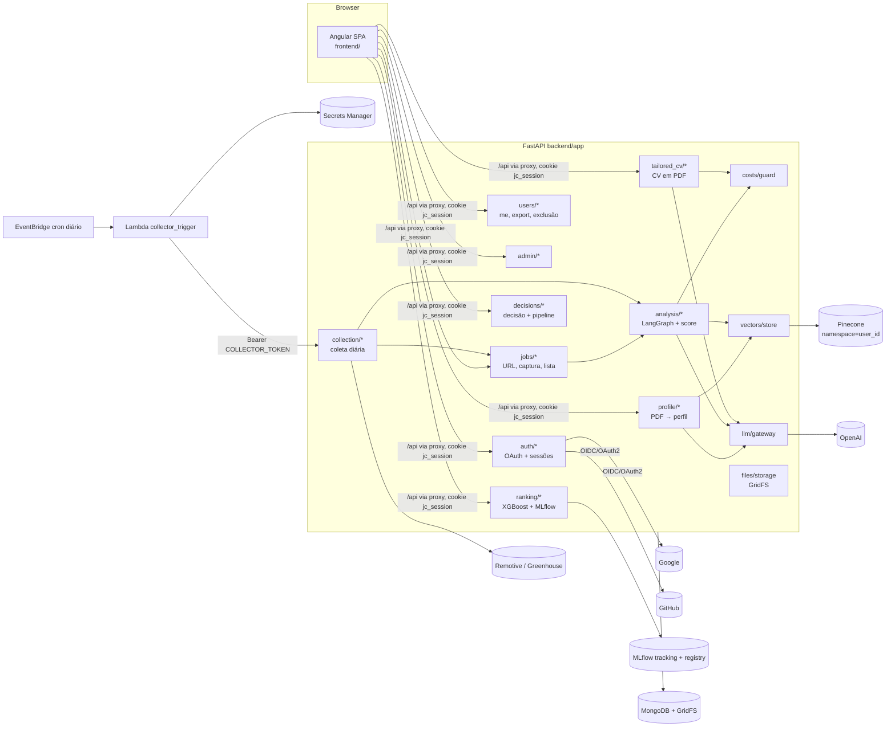
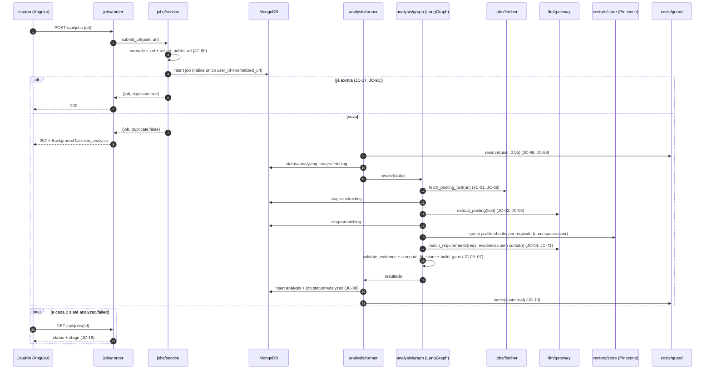

# Plano Técnico — Copiloto de Busca de Vagas (Jobs Copilot) — plano inicial

## 1. Resumo Executivo

O Jobs Copilot é construído do zero (o repositório só tem o commit vazio
`b4ba076` em `develop`) como um monorepo com três partes:

- `backend/`: API **FastAPI** em Python 3.12, gerida com **uv**. Persiste em
  **MongoDB** (PyMongo síncrono + GridFS para os PDFs), orquestra a análise
  de vaga com **LangGraph** e chama o LLM e os embeddings por **LangChain**
  (provedor OpenAI). Os vetores do perfil e das vagas ficam no **Pinecone**,
  num namespace por usuário. O modelo de ranqueamento é um **XGBoost** por
  usuário, avaliado com **scikit-learn** e registrado no **MLflow**.
- `frontend/`: SPA **Angular 22** (standalone, signals, Vitest), servida em
  desenvolvimento com proxy `/api` para o backend, o que mantém o cookie de
  sessão na mesma origem.
- `infra/` + `backend/lambdas/`: uma **AWS Lambda** agendada por uma regra do
  **EventBridge** (template SAM) que dispara a coleta diária chamando um
  endpoint interno do backend.

O plano cobre os 85 critérios ativos do spec em 55 tasks. As tasks foram
escritas como aulas: o humano implementa todas à mão (spec, seção 3). Cada
task traz o objetivo de aprendizado, o passo a passo com comandos, o gabarito
de **interface** (assinaturas, contratos e casos de teste) e os comandos de
validação que o revisor roda no fim. O corpo das funções não entra neste
plano: o `plan-architect` não escreve implementação. O gabarito completo de
código, quando o humano pedir, sai na execução de cada task.

Impacto: cria todo o sistema. Os pontos de maior risco são autenticação
OAuth e sessão (AS-1), dado pessoal do CV que não pode chegar aos provedores
externos depois da extração (AS-3), os direitos LGPD (AS-5), o endpoint
interno chamado pela Lambda (AS-6), os segredos (AS-7) e as oito
integrações novas com terceiros (AS-8).

## 2. Premissas e Lacunas

### 2.1 Decidido pelo humano (de `decisions.md`)

| ID | Decisão | Consequência no plano |
|---|---|---|
| LAC-01 | Perfil vem do upload de CV em PDF e da edição manual; nada de `/master-cv` | `profile/pdf_text.py` + `profile/extraction.py` (TASK-016, TASK-020); rascunho revisável antes de salvar (DA-9) |
| LAC-02 | CV adaptado só em PDF | `tailored_cv/pdf.py` com ReportLab (DA-10); download `GET /api/tailored-cvs/{id}/pdf` |
| LAC-03 | Score = cobertura ponderada; embeddings fora do score | `analysis/scoring.py` é função pura e determinística; os embeddings só alimentam a recuperação de evidência e o atributo `similarity` do ranqueamento (DA-7) |
| LAC-04 | Qualquer página pública sem login + opção de colar texto | `jobs/fetcher.py` com guarda SSRF (`jobs/url.py`); falha vira `failed` com `FETCH_FAILED` e a rota `POST /api/jobs/{id}/text` |
| LAC-05 | Angular desde o MVP | `frontend/` entra na TASK-011, e cada história P1 tem tela |
| LAC-06 | Multiusuário com isolamento | `user_id` em todo documento; todo acesso filtra por `user_id` e responde 404 para recurso alheio (DA-4); namespace Pinecone = `user_id`; MLflow com experimento e modelo registrado por usuário (DA-12) |
| LAC-07 | Só o conteúdo profissional vai a provedores externos | `ContactInfo` separado de `ProfileContent` (CT-13); `profile_to_chunks` e os prompts recebem só `ProfileContent` (DA-8) |
| LAC-08 | Etapas `applied`→`interview`→`offer` + `rejected`/`withdrawn` | `decisions/pipeline.py` com a tabela de transições (CT-29) |
| LAC-09 | APIs e feeds públicos, filtros, 1×/dia | Fontes Remotive e Greenhouse (premissa P-10); EventBridge `cron(0 9 * * ? *)` |
| LAC-10 | 30 decisões, ≥5 por classe, promove só se superar o baseline | `ranking/trainer.py` (CT-36): mínimo checado por usuário, promoção se AUC do modelo > AUC do baseline |
| LAC-11 | Só destaque na interface | Flag `highlighted` na vaga e contador em `GET /api/me`; nenhum envio externo |
| LAC-12 | Usuário escolhe o idioma do CV (en padrão, pt, es) | `language` no `POST /api/jobs/{id}/tailored-cvs`, padrão `en` |
| LAC-13 | Mesma URL do mesmo usuário devolve a análise existente + reanalisar | Índice único `(user_id, normalized_url)`; `POST /api/jobs` responde 200 com `duplicate: true` |
| LAC-14 | Teto mensal por usuário e global | `costs/guard.py` com reserva atômica (CT-7, DA-11) |
| LAC-15 | Até 60 s, com progresso por etapa | Campo `stage` na vaga + polling de 2 s no front; prazo de 60 s no runner (`ANALYSIS_TIMEOUT`) |
| LAC-17 | Retenção enquanto a conta existir; exclusão em cascata por vaga e por conta | `jobs/service.delete_job` (JC-57) e `users/deletion.py` (JC-64) |
| LAC-19 | Cadastro por convite (lista de e-mails) + administrador | Coleção `allowed_emails`, papel `admin`, rotas `/api/admin/*` sem nenhum acesso a dado de usuário |
| LAC-20 | Só login social Google/GitHub | Authlib (`auth/oauth.py`), e-mail verificado obrigatório; nenhuma rota de senha |
| LAC-21 | Novo PDF substitui o perfil inteiro após confirmação | `replace_confirmed=true` obrigatório quando já há perfil (409 `PROFILE_REPLACE_CONFIRMATION_REQUIRED`) |
| LAC-22 | Sem OCR, limite de 5 MB | `read_pdf_text` recusa >5 MB (413) e PDF sem texto (422 `PDF_NO_TEXT`) |
| LAC-23 | Limiar por usuário, padrão 70 | `settings.highlight_threshold` (0–100, padrão 70); pontuação do modelo promovido, senão o score |
| LAC-24 | Aceite versionado + exportação + exclusão | `terms_acceptances[]` no usuário; `GET /api/me/export` (ZIP, P-04); `DELETE /api/me` |
| LAC-25 | Pesos 3:1 | `WEIGHTS = {"must_have": 3, "nice_to_have": 1}` em `analysis/scoring.py` |

### 2.2 Premissas assumidas (lacunas não bloqueantes)

| ID | Premissa | Reversibilidade | Onde impacta |
|---|---|---|---|
| LAC-16 | Textos da seção 9 do spec, traduzidos para inglês | alta | componentes Angular; coluna "Mensagem" da seção 8.3 |
| LAC-18 | Interface em inglês | alta | todo `frontend/` |
| P-01 | LLM e embeddings da OpenAI via LangChain (`init_chat_model`, `OpenAIEmbeddings` `text-embedding-3-small`, 1536 dimensões). Modelo e preços por token vêm do `.env` (`LLM_MODEL`, `LLM_PRICE_*`) | alta: trocar o provedor é mudar o `.env` e o pacote `langchain-<provedor>` | `llm/gateway.py`, `llm/pricing.py`, `vectors/embeddings.py` |
| P-02 | A hospedagem pública da API e do front fica fora deste plano: o sistema roda localmente (Docker Compose + `uv` + `ng serve`). A Lambda recebe `ApiBaseUrl` como parâmetro do SAM | média | `infra/template.yaml`, README |
| P-03 | O primeiro administrador vem da variável `BOOTSTRAP_ADMIN_EMAILS`: esses e-mails podem se cadastrar sem convite e nascem com papel `admin` | alta | `auth/signup.py` |
| P-04 | A exportação LGPD é um ZIP com `data.json` (UTF-8, datas ISO-8601 UTC, ids como string) + `files/source_cv.pdf` + `files/tailored_cvs/<id>.pdf` | alta | `users/export.py` |
| P-05 | Quando `TERMS_VERSION` muda, o sistema não pede novo aceite: só registra a versão aceita no cadastro | média | `auth/signup.py` |
| P-06 | Recomendação de gap determinística: `nice_to_have` (parcial ou ausente) → "acceptable (nice-to-have)"; `must_have` `partial` → "record real experience in profile"; `must_have` `missing` → "study before applying" | alta | `analysis/scoring.py` |
| P-07 | Mudar a decisão de `apply` para `skip` apaga a candidatura se ela ainda estiver em `applied`. Se já avançou, a mudança é recusada com 409 `APPLICATION_IN_PROGRESS` | alta | `decisions/service.py` |
| P-08 | A exclusão da conta também remove o e-mail de `allowed_emails`. Assim a conta excluída não entra mais (JC-64), e um novo cadastro exige novo convite | alta | `users/deletion.py` |
| P-09 | A extração do CV e os embeddings do perfil têm o custo registrado (contam no acumulado), mas não são bloqueados pelo teto. O JC-99 só bloqueia análise e geração de CV | alta | `profile/service.py`, `costs/guard.py` |
| P-10 | Fontes de coleta: Remotive (`category=software-dev`, 1 requisição por execução) e Greenhouse Job Board API (boards em `GREENHOUSE_BOARDS`). O filtro por palavra-chave, modalidade e localidade roda localmente | alta: novas fontes implementam o protocolo `JobSource` (CT-31) | `collection/sources/*` |
| P-11 | A métrica de promoção é a ROC AUC fora da dobra (`StratifiedKFold(5, shuffle=True, random_state=42)`). O baseline é a AUC do `fit_score` sobre os mesmos rótulos. Promove se `auc_model > auc_baseline` | alta | `ranking/trainer.py` |
| P-12 | Tamanho máximo processável da vaga: `MAX_POSTING_CHARS=30000` | alta | `analysis/runner.py` |
| P-13 | Tetos padrão: `DEFAULT_USER_COST_CAP_USD=5.0` e `DEFAULT_GLOBAL_COST_CAP_USD=50.0`. Estimativas de reserva: `ANALYSIS_COST_ESTIMATE_USD=0.05` e `CV_COST_ESTIMATE_USD=0.05` | alta | `config.py`, `costs/guard.py` |
| P-14 | A sessão dura 14 dias (`SESSION_TTL_DAYS`), em cookie `jc_session` HttpOnly, SameSite=Lax, `Secure` quando `COOKIE_SECURE=true` | alta | `auth/sessions.py` |
| P-15 | Versões: Python 3.12 (`.python-version`), Angular 22.2 (`@angular/cli` 22.2.1 conferido no npm em 2026-10-01), Node 24, MongoDB 7 | média | `pyproject.toml`, `package.json`, `docker-compose.yml` |
| P-16 | QA de tela automatizado usa a API simulada (`page.route`). Não existe login de desenvolvimento que contorne o OAuth | alta | `frontend/e2e/` |

### 2.3 Lacunas ainda abertas

Nenhuma. As lacunas bloqueantes LAC-01 a LAC-15, LAC-17 e LAC-19 a LAC-25
têm decisão em `decisions.md`, e LAC-16 e LAC-18 são premissas. Os três
pontos que o spec-writer deixou abertos sem lacuna foram resolvidos como
premissas: primeiro admin (P-03), formato da exportação (P-04) e reaceite de
termos (P-05).

## 3. Ambiente e Comandos de Verificação

Projeto greenfield: nenhum arquivo de build existe ainda. Os comandos abaixo
são **declarados por este plano** e passam a existir quando as tasks citadas
na coluna Origem criam os arquivos. A sintaxe do Angular foi conferida no
schema do builder `@angular/build:unit-test` 22.2.1 (opções `include`,
`reporters`, `outputFile`). O `run.py doctor` só passa depois de TASK-002 e
TASK-011.

| Alvo | Comando | Diretório | Relatório | Origem |
|---|---|---|---|---|
| Instalar dependências (backend) | `uv sync` | `backend` | — | TASK-002 cria `backend/pyproject.toml` e `uv.lock` |
| Instalar dependências (frontend) | `npm ci` | `frontend` | — | TASK-011 cria `frontend/package-lock.json` |
| Lint (backend) | `uv run ruff check . --output-format=concise` | `backend` | — | TASK-002, `[tool.ruff]` em `backend/pyproject.toml` |
| Lint (frontend) | `npx ng lint` | `frontend` | — | TASK-011, `ng add angular-eslint` grava o target `lint` em `angular.json` |
| Typecheck (backend) | `uv run mypy app lambdas` | `backend` | — | TASK-002, `[tool.mypy]` em `backend/pyproject.toml` |
| Typecheck (frontend) | `npx tsc --noEmit -p tsconfig.app.json` | `frontend` | — | TASK-011, `frontend/tsconfig.app.json` |
| Teste (suíte) (backend) | `uv run pytest -q` | `backend` | `reports/junit.xml` | TASK-002, `addopts` em `[tool.pytest.ini_options]` |
| Teste (suíte) (frontend) | `npx ng test --watch=false` | `frontend` | `reports/junit.xml` | TASK-011, `test.options.reporters` em `angular.json` |
| Teste (relacionado a arquivo) (backend) | `uv run pytest -q {files}` | `backend` | `reports/junit.xml` | TASK-002 |
| Teste (relacionado a arquivo) (frontend) | `npx ng test --watch=false {include}` | `frontend` | `reports/junit.xml` | TASK-011; `--include` aceita caminho relativo a `frontend` (`src/app/...`) |
| Teste e2e (Playwright) | `npx playwright test {files}` | `frontend` | `reports/e2e-junit.xml` | TASK-011 cria `frontend/playwright.config.ts` |
| Arquivo de regressão e2e | `frontend/e2e/regressao/{nome}.spec.ts` | — | — | convenção do pipeline |
| Build (backend) | `uv build --wheel` | `backend` | — | TASK-002, `[build-system]` hatchling |
| Build (frontend) | `npx ng build` | `frontend` | — | TASK-011 |
| Subir ambiente local | `docker compose up -d && (cd backend && uv run uvicorn app.main:app --reload --port 8000) & (cd frontend && npx ng serve --port 4200)` | `.` | — | TASK-001 `docker-compose.yml`, README |
| URL da aplicação | `http://localhost:4200` | — | — | TASK-011 `frontend/proxy.conf.json` (`/api` → `http://localhost:8000`) |
| Credenciais QA | N/A — o login é só por OAuth Google/GitHub (LAC-20). O QA de tela usa a API simulada (P-16) | — | — | — |

Detalhes que as tasks devem respeitar:

- `backend/pyproject.toml` → `[tool.pytest.ini_options]`:
  `addopts = "--junitxml=reports/junit.xml -m 'not external'"`,
  `testpaths = ["tests"]`, `markers = ["external: chama serviço pago real (OpenAI, Pinecone, MLflow remoto)"]`.
  Testes `external` só rodam à mão (`uv run pytest -q -m external`) e nunca
  entram no gate.
- Os testes de integração do backend precisam do MongoDB do
  `docker compose up -d mongo` em `MONGO_URI=mongodb://localhost:27017`.
  Cada sessão de pytest usa um banco próprio `jobs_copilot_test_<uuid4hex>`,
  apagado no fim (fixture `db`, seção 6).
- `frontend/angular.json` → `projects.frontend.architect.test.options`:
  `"reporters": [["junit", {"outputFile": "reports/junit.xml"}], "default"]`.
- A pasta `reports/` entra no `.gitignore` (TASK-001).
- Não há falha conhecida: o repositório não tem código nem CI.

## 4. Estratégia de Testes

Sem `.specs/codebase/TESTING.md` e sem testes no repositório (greenfield).
Esta tabela é a convenção definida pelo plano.

| Camada / pasta | Tipo exigido | Paralelo-seguro | Observação |
|---|---|---|---|
| `backend/tests/unit` | unit | sim | Funções puras e classes com dependência simulada (`tests/fakes.py`). Sem rede nem banco |
| `backend/tests/integration` | integration | sim | `TestClient` do FastAPI + MongoDB real, num banco único por sessão de pytest (nenhum outro processo enxerga o banco). LLM, Pinecone e MLflow simulados por `dependency_overrides` |
| `backend/tests/external` | integration | não | Marcados `@pytest.mark.external`, fora do gate. Exercitam OpenAI, Pinecone e MLflow reais, e custam dinheiro |
| `frontend/src/app` | unit | sim | Vitest + `TestBed`; HTTP com `provideHttpClientTesting` |
| `frontend/e2e` | e2e | não | Playwright com porta fixa 4200 e API simulada por `page.route` |

Regras:

- **Co-location**: o teste é escrito na mesma task que cria o código.
- **Contagem**: cada task diz quantos testes novos espera no `Done when`. O
  revisor confere pelo JUnit (`reports/junit.xml`).
- **LLM nunca é chamado no gate**: toda chamada passa por `LLMGateway`
  (CT-11), que os testes trocam por `FakeLLMGateway`.
- **Isolamento**: toda rota de dado tem ao menos um teste "usuário B pede
  recurso de A → 404" (JC-62).

## 5. Arquitetura Proposta

### 5.1 Visão de Componentes



Camadas do backend (convenção nova, aplicada a todos os módulos):
`router.py` (HTTP, valida entrada, traduz para o serviço) → `service.py`
(regra de negócio, recebe `db` e dependências por parâmetro) →
`repository.py` ou acesso direto a `db[Collections.X]` (persistência). Os
serviços nunca leem `get_settings()` direto: recebem `Settings` ou valores
por parâmetro, o que facilita o teste.

### 5.2 Fluxo Principal

Análise de uma vaga a partir da URL (história P1 central):



Narrativa: o envio grava a vaga e responde na hora. A análise roda em
`BackgroundTasks` (mesmo processo) e atualiza `stage` a cada nó do grafo. O
front faz polling até `analyzed` ou `failed`. Qualquer exceção no grafo vira
`failed` com `failure.code` e `failure.reason`, sem análise parcial (JC-87).
Passados 60 s, a vaga vira `failed` com `ANALYSIS_TIMEOUT`. A coleta diária
(P2) reutiliza `run_analysis` vaga a vaga.

### 5.3 Decisões Arquiteturais

| # | Decisão | Alternativas rejeitadas | Por quê |
|---|---|---|---|
| DA-1 | Monorepo `backend/` (uv) + `frontend/` (Angular CLI) + `infra/` (SAM) | Repositórios separados | Um projeto de aprendizado e vitrine fica mais simples de navegar num repositório só; o `run.py` suporta uma linha por diretório |
| DA-2 | FastAPI com endpoints síncronos e PyMongo síncrono | Motor/PyMongo async | Menos conceitos para quem aprende; o volume (10–15 vagas/semana por usuário) não pede async; LangGraph e LangChain funcionam bem em modo síncrono |
| DA-3 | Sessão opaca no servidor: token aleatório de 32 bytes no cookie e o SHA-256 dele na coleção `sessions` (com índice TTL) | JWT sem estado | JC-63 e JC-67 exigem invalidar sessões na hora; com JWT isso exigiria uma lista de revogação |
| DA-4 | Isolamento por consulta: toda função de acesso recebe `user_id` e filtra por ele. Recurso de outro usuário, ou com id inválido, responde **404 `NOT_FOUND`** idêntico | Middleware genérico ou bancos por usuário | É explícito e testável por rota. O 404 idêntico atende JC-62 e JC-68 |
| DA-5 | OAuth com Authlib (`starlette_client`). O estado do OAuth e o cadastro pendente ficam no cookie assinado do `SessionMiddleware` (`SESSION_SECRET`), por 10 min | fastapi-users, Auth0/Cognito | Authlib é a biblioteca padrão para OIDC em Starlette. O cadastro pendente fica no cookie, e não no banco, para não guardar dado de visitante antes do aceite (JC-60) |
| DA-6 | Análise como `StateGraph` do LangGraph com nós `fetch → extract → retrieve → match → score`. Cada nó grava `stage` na vaga | Cadeia LCEL única ou agente ReAct livre | Os nós mapeiam 1:1 as etapas exibidas (JC-18), são testáveis um a um e mantêm o score fora do LLM |
| DA-7 | Score e gaps calculados por código puro (`analysis/scoring.py`) a partir dos status. O LLM só classifica e cita evidência | LLM devolvendo o score | JC-06 dá a fórmula exata; a defesa contra prompt injection (JC-83) fica mais forte porque o LLM não controla o número |
| DA-8 | `LLMGateway` (CT-11) é a única porta para o LLM. Os métodos de análise e CV recebem `ProfileContent`, que não tem campos de contato. Só `extract_profile` recebe o texto bruto do PDF | Chamar LangChain direto nos serviços | Garante JC-71 e JC-56 por tipo: não há como passar `ContactInfo` a um prompt pós-extração. Os testes trocam o gateway por um fake |
| DA-9 | Upload do PDF cria um **rascunho** (`profile_drafts`) com o arquivo `pending` no GridFS. O perfil só muda no `PUT /api/profile` com `draft_id`; `DELETE /api/profile/draft` cancela | Substituir o perfil no upload | Atende JC-73 (revisar antes de salvar) e JC-76 (cancelar mantém tudo) |
| DA-10 | O CV adaptado é gerado assim: o LLM devolve conteúdo estruturado (`TailoredCvContent`) que referencia experiências por índice. Empresa, cargo e datas vêm do perfil, não do LLM. Validadores determinísticos (CT-23) checam o resultado, e o ReportLab desenha o PDF com o cabeçalho de contato montado localmente | Markdown→HTML→Chrome (como o `/generate-cv`); WeasyPrint | ReportLab não tem dependência de sistema. A referência por índice torna JC-12 verificável por código, e o cabeçalho local garante JC-56 |
| DA-11 | Teto de custo com **reserva atômica**: `find_one_and_update` com `$expr` `spent+reserved < cap` incrementa `reserved_usd` pela estimativa; o `settle` troca a reserva pelo custo real | Checar e depois somar | Limita o estouro a uma operação (JC-59) sem lock distribuído |
| DA-12 | MLflow: experimento `ranking/<user_id>` e modelo registrado `ranking-<user_id>`. O modelo promovido usa o alias `champion`, e o espelho em Mongo é `ranking_models` (`promoted_version`). `model_score` é pré-calculado na vaga | Um modelo global ou stages (descontinuados) | Atende JC-45 e JC-65 com segregação explícita; a lista não depende do MLflow estar no ar |
| DA-13 | A Lambda é um gatilho fino: lê `COLLECTOR_TOKEN` do Secrets Manager e chama `POST /api/internal/collection-runs`. A coleta roda no backend | Rodar a coleta inteira na Lambda | Não duplica dedupe, teto, isolamento e análise; a Lambda fica sem dependência além do `boto3` do runtime |
| DA-14 | Fontes de coleta buscam **uma vez por execução** e filtram por usuário localmente (`matches_criteria`) | Uma requisição por usuário | Respeita os limites das APIs públicas e simplifica a execução |
| DA-15 | PDFs (CV de origem e CVs adaptados) no GridFS do MongoDB, com `metadata.user_id` | S3 | Um armazenamento só, cascata simples por `user_id` e nenhuma credencial AWS no backend |
| DA-16 | Frontend standalone com signals, sem biblioteca de UI (CSS próprio) e serviços HTTP por feature | Angular Material | Menos dependências para aprender e manter |

## 6. Reuso Obrigatório

Projeto greenfield: não há código a reaproveitar no repositório. O reuso
obrigatório é **interno à feature**: o que uma task cria e as seguintes
**devem** usar em vez de recriar. Cada item foi conferido contra a tarefa
produtora deste plano. Não é Grep, porque os arquivos ainda não existem.

| Precisa de | Já existe em (task produtora) | Como usar |
|---|---|---|
| Erro de negócio com código e HTTP | `backend/app/errors.py` (TASK-003) | `raise AppError("NOT_FOUND", "Not found.", 404)`. Nunca `HTTPException` em serviço |
| Configuração | `backend/app/config.py` (TASK-003) | `get_settings()` só em `deps.py` e `main.py`; os serviços recebem `Settings` por parâmetro |
| Banco e nomes de coleção | `backend/app/db.py` (TASK-003/004) | `db[Collections.JOBS]`; nunca string literal de coleção |
| Usuário autenticado | `backend/app/deps.py` → `get_current_user`, `require_admin` (TASK-005) | `user: CurrentUser = Depends(get_current_user)` em toda rota de dado |
| PDFs | `backend/app/files/storage.py` (TASK-017) | `put_file`, `get_file`, `delete_*`. Nunca `GridFSBucket` direto |
| LLM | `backend/app/llm/gateway.py` → `LLMGateway`, `get_llm_gateway` (TASK-018) | Injetar por `Depends(get_llm_gateway)`. Nunca instanciar `ChatOpenAI` fora do gateway |
| Custo | `backend/app/costs/guard.py` (TASK-008) | `reserve` antes e `settle` depois de toda análise e geração de CV; `record_cost` para extração e embeddings |
| Vetores | `backend/app/vectors/store.py`, `embeddings.py` (TASK-019) | `namespace=user_id` sempre |
| Perfil sem contato | `backend/app/profile/models.py` → `ProfileContent` (TASK-016) | O que vai a LLM e Pinecone depois da extração é sempre `ProfileContent` ou derivado dele |
| URL | `backend/app/jobs/url.py` → `normalize_url`, `assert_public_url` (TASK-025) | Também nas fontes de coleta (dedupe por URL) |
| Vagas | `backend/app/jobs/repository.py` (TASK-027) | `get_job(db, user_id, job_id)` lança 404 para recurso alheio |
| Análise | `backend/app/analysis/runner.py` → `run_analysis` (TASK-028) | A coleta (TASK-047) chama a mesma função; não existe segunda implementação |
| Fixture `db` | `backend/tests/conftest.py` (TASK-004) | `pymongo.database.Database` do banco `jobs_copilot_test_<uuid>` de **uma** `MongoClient` de sessão; as coleções são esvaziadas depois de cada teste. **Todas** as outras fixtures (`client`, `make_user`, `login_as`) usam este mesmo `db`, nunca outro cliente |
| Fixture `settings` | `backend/tests/conftest.py` (TASK-004) | `Settings` com segredos fictícios e `MONGO_DB` do banco de teste |
| Fixture `client` | `backend/tests/conftest.py` (TASK-004; overrides de LLM, embedder e vetores somados em TASK-022; de registry em TASK-054) | `TestClient(create_app(settings))` com `dependency_overrides[get_db] = lambda: db` |
| Fixtures `make_user`, `login_as` | `backend/tests/conftest.py` (TASK-005) | `make_user(email="a@x.com", role="user", active=True) -> dict` insere no mesmo `db`; `login_as(client, user)` chama `create_session(db, user_id)` e grava o cookie `jc_session` no `client` |
| Fakes | `backend/tests/fakes.py` (TASK-018 `FakeLLMGateway`; TASK-019 `FakeEmbedder`, `InMemoryVectorStore`; TASK-052 `FakeModelRegistry`) | Para teste unitário e de integração; nunca serviço real no gate |
| Cliente HTTP do front | `frontend/src/app/core/api.interceptor.ts` (TASK-012) | Toda chamada usa `HttpClient` com URL relativa `/api/...`; o interceptor converte o erro em `ApiError` |
| Usuário logado no front | `frontend/src/app/core/auth.service.ts` (TASK-012) | `inject(AuthService).me()` (signal); rotas protegidas com `authGuard`/`adminGuard` |
| Regras de CV (referência) | `~/.claude/commands/generate-cv.md` §5.2 e §7 (fora do repo, só leitura) | Ordem das seções `Summary, Key Achievements, Experience, Projects, Skills, Languages, Education, Certifications`; A4, coluna única, corpo 10 pt, máx. 2 páginas, datas `Mon YYYY` |

Padrões a copiar entre tasks:
- O router de `jobs` (TASK-030) é o modelo das demais rotas: prefixo
  `/api/<recurso>`, `response_model` Pydantic e `Depends(get_current_user)`.
- O teste de isolamento de `tests/integration/test_jobs_api.py` (TASK-030) é
  o modelo dos testes 404 cruzados.
- `features/jobs/jobs.service.ts` (TASK-031) é o modelo de serviço HTTP com
  signals no front.

## 7. Modelos de Dados

MongoDB, banco `MONGO_DB` (padrão `jobs_copilot`). `_id` é `ObjectId`,
exceto quando indicado. Datas em UTC (`datetime` com tz). 🔒 = dado pessoal.
Todos os índices são criados por `ensure_indexes(db)` (idempotente, chamado
no startup).

| Coleção (`Collections.X`) | Campos | Índices |
|---|---|---|
| `users` (USERS) | `email` 🔒 (str, minúsculo), `identities[]` {`provider`: google\|github, `subject` 🔒}, `role`: user\|admin, `active`: bool, `created_at`, `terms_acceptances[]` {`version`, `accepted_at`}, `settings` {`highlight_enabled`: bool=true, `highlight_threshold`: int=70, `cost_cap_usd`: float}, `deletion_pending`: bool=false | único `email`; único `identities.provider`+`identities.subject` |
| `allowed_emails` (ALLOWED_EMAILS) | `_id`: email 🔒 normalizado, `added_at`, `added_by` (user_id) | — |
| `signup_attempts` (SIGNUP_ATTEMPTS) | `email_sha256`, `provider`, `outcome`: rejected_not_invited\|pending_terms\|created, `at` | `email_sha256` |
| `sessions` (SESSIONS) | `_id`: sha256(token), `user_id`, `created_at`, `expires_at` | TTL `expires_at` (expireAfterSeconds=0); `user_id` |
| `profiles` (PROFILES) | `_id`: user_id (str), `contact_info` 🔒 {`full_name`, `email`, `phone`, `location`, `links[]`, `salary_expectation`, `work_authorization`}, `content` {`headline`, `summary`, `experiences[]` {`title`, `company`, `start`, `end`, `location`, `description`, `achievements[]`}, `education[]`, `certifications[]`, `skills[]`, `languages[]` {`name`, `level`}, `projects[]` {`name`, `description`, `url`, `technologies[]`}}, `source_cv_file_id`, `updated_at` | — |
| `profile_drafts` (PROFILE_DRAFTS) | `_id`: user_id, `file_id`, `profile` (mesma forma de `contact_info`+`content`), `created_at` | — |
| `fs.files` / `fs.chunks` (GridFS) | `metadata` {`user_id`, `kind`: source_cv\|tailored_cv, `status`: active\|pending, `job_id`?} 🔒 (PDF de CV) | `metadata.user_id` |
| `job_postings` (JOBS) | `user_id`, `url`, `normalized_url`, `source`: manual\|remotive\|greenhouse:<board>, `source_job_id`?, `raw` {`text`, `fetched_at`, `content_type`, `pasted`: bool}, `extracted` {`title`, `company`, `location`, `modality`, `seniority`, `requirements[]` {`id`, `text`, `kind`, `source_quote`}} (campo ausente = `null` = "not informed"), `status`: captured\|analyzing\|analyzed\|failed, `stage`: fetching\|extracting\|matching\|scoring\|null, `failure` {`code`, `reason`}?, `latest_analysis_id`, `fit_score`?, `model_score`?, `model_version`?, `highlighted`: bool, `highlight_seen`: bool, `skipped`: bool, `created_at`, `analyzed_at`, `last_seen_at` | único (`user_id`, `normalized_url`); único parcial (`user_id`, `source`, `source_job_id`) quando `source_job_id` existe; (`user_id`, `skipped`, `fit_score`) |
| `analyses` (ANALYSES) | `user_id`, `job_id`, `profile_version` (= `profiles.updated_at`), `requirements[]` {`id`, `text`, `kind`, `source_quote`, `status`: met\|partial\|missing, `evidence` {`section`, `quote`}?}, `fit_score`, `score_breakdown[]` {`requirement_id`, `kind`, `weight`, `value`}, `gaps[]` {`requirement_id`, `text`, `kind`, `status`, `recommendation`}, `similarity`, `cost_usd`, `created_at` | (`user_id`, `job_id`, `created_at`) |
| `tailored_cvs` (TAILORED_CVS) | `user_id`, `job_id`, `analysis_id`, `version`: int, `language`: en\|pt\|es, `file_id`, `page_count`, `keyword_coverage[]` {`keyword`, `section`?}, `cost_usd`, `created_at` | (`user_id`, `job_id`, `version`) único |
| `decisions` (DECISIONS) | `user_id`, `job_id`, `decision`: apply\|skip, `fit_score_shown`, `ranking_version` ("baseline" ou versão), `created_at` | (`user_id`, `job_id`, `created_at`) |
| `applications` (APPLICATIONS) | `user_id`, `job_id`, `stage`, `transitions[]` {`from`, `to`, `at`}, `created_at`, `updated_at` | único (`user_id`, `job_id`) |
| `search_criteria` (SEARCH_CRITERIA) | `_id`: user_id, `keywords[]`, `modalities[]` (remote\|hybrid\|onsite), `locations[]`, `updated_at` | — |
| `collection_runs` (COLLECTION_RUNS) | `status`: running\|completed\|skipped, `started_at`, `finished_at`, `per_user[]` {`user_id`, `source`, `found`, `new`, `duplicate`, `failed`, `error`?} | `started_at` |
| `locks` (LOCKS) | `_id`: "collection_run", `owner`, `locked_until` | — |
| `cost_ledgers` (COST_LEDGERS) | `_id`: "<user_id>:<YYYY-MM>" ou "global:<YYYY-MM>", `user_id`?, `month`, `spent_usd`, `reserved_usd` | `user_id` |
| `cost_events` (COST_EVENTS) | `user_id`, `operation`: analysis\|tailored_cv\|profile_extraction\|embedding, `cost_usd`, `job_id`?, `at` | (`user_id`, `at`) |
| `settings` (SETTINGS) | `_id`: "global", `global_cost_cap_usd`, `updated_at`, `updated_by` | — |
| `ranking_models` (RANKING_MODELS) | `_id`: user_id, `promoted_version`?, `promoted_at`?, `last_training` {`at`, `promoted`: bool, `reason`, `auc_model`, `auc_baseline`, `n_apply`, `n_skip`, `version`?} | — |

`USER_SCOPED_COLLECTIONS` (CT-3) = PROFILES, PROFILE_DRAFTS, JOBS, ANALYSES,
TAILORED_CVS, DECISIONS, APPLICATIONS, SEARCH_CRITERIA, COST_EVENTS,
COST_LEDGERS, SESSIONS, RANKING_MODELS. É a lista que a exportação e a
exclusão percorrem, com filtro `user_id` (ou `_id` = user_id).

Pinecone: índice `PINECONE_INDEX` (serverless, dimensão 1536, métrica
cosine), namespace = `user_id`. IDs: `profile#<section>#<n>` (metadados
`kind=profile`, `section`, `text`) e `job#<job_id>` (`kind=job`). Contato
nunca entra.

MLflow: experimento `ranking/<user_id>`; modelo registrado
`ranking-<user_id>`, alias `champion`.

## 8. Contratos

### 8.1 Contratos externos (API)

Base `/api`. JSON UTF-8. Toda rota, menos as marcadas **pública** ou
**interna**, exige o cookie `jc_session` válido (senão 401
`UNAUTHENTICATED`, JC-96). Formato de erro único (CT-1):

```json
{"error": {"code": "NOT_FOUND", "message": "Not found.", "details": {}}}
```

Erros de validação do Pydantic são convertidos para `VALIDATION_ERROR`
(422), com `details.fields` = lista de `{loc, msg}`.

**Autenticação (CT-40)**

| Método e rota | Request | Resposta | Erros |
|---|---|---|---|
| `GET /api/auth/login/{provider}` **pública** | `provider` ∈ `google`,`github` | 302 para o provedor | 404 provider desconhecido |
| `GET /api/auth/callback/{provider}` **pública** | query do OAuth | 302 `/jobs` (usuário ativo, cookie criado) · 302 `/signup/terms` (convidado novo) · 302 `/login?error=not_invited` · 302 `/login?error=login_failed` (falha, e-mail não verificado ou conta desativada) | — (sempre redireciona) |
| `GET /api/auth/signup/pending` **pública** | — | 200 `{email, provider, terms_version}` | 401 `SIGNUP_EXPIRED` |
| `POST /api/auth/signup` **pública** | `{accept_terms: true, terms_version: str}` | 201 `{id, email, role}` + cookie (o front chama `GET /api/me` em seguida) | 422 `TERMS_NOT_ACCEPTED` · 409 `TERMS_VERSION_MISMATCH` · 401 `SIGNUP_EXPIRED` · 403 `NOT_INVITED` |
| `POST /api/auth/logout` | — | 204, cookie apagado | — |

**Conta (CT-8)**

| Método e rota | Request | Resposta | Erros |
|---|---|---|---|
| `GET /api/me` | — | 200 `MeResponse` = `{id, email, role, settings: {highlight_enabled, highlight_threshold, cost_cap_usd}, month_cost_usd, user_cap_reached, global_cap_reached, highlight_count, terms_version_accepted}` | 401 |
| `PATCH /api/me/settings` | `{highlight_enabled?: bool, highlight_threshold?: int, cost_cap_usd?: float}` | 200 `MeResponse` | 422 `INVALID_THRESHOLD` (fora de 0–100, JC-46) · 422 `INVALID_COST_CAP` (< 0) |
| `GET /api/me/export` | — | 200 `application/zip`, `Content-Disposition: attachment; filename="jobs-copilot-export-<YYYYMMDD>.zip"` (P-04) | 401 |
| `DELETE /api/me` | `{confirm: true}` | 204, cookie apagado | 422 `ACCOUNT_DELETE_CONFIRMATION_REQUIRED` · 502 `DEPENDENCY_FAILED` (Pinecone/MLflow; nada é apagado no Mongo) |

**Administração (CT-39)**, todas com `require_admin` (não admin → 403 `FORBIDDEN`)

| Método e rota | Request | Resposta | Erros |
|---|---|---|---|
| `GET /api/admin/allowed-emails` | — | 200 `[{email, added_at}]` | — |
| `POST /api/admin/allowed-emails` | `{email}` | 201 `{email, added_at}` (idempotente: já existente → 200) | 422 `VALIDATION_ERROR` |
| `DELETE /api/admin/allowed-emails/{email}` | — | 204 (conta existente não é afetada, JC-66) | 404 |
| `GET /api/admin/users` | — | 200 `[{id, email, active, created_at, month_cost_usd}]` (só isso, JC-68) | — |
| `PATCH /api/admin/users/{user_id}` | `{active: bool}` | 200 `{id, email, active, created_at, month_cost_usd}`; desativar revoga as sessões (JC-67) | 404 · 409 `CANNOT_DEACTIVATE_SELF` |
| `GET /api/admin/settings` | — | 200 `{global_cost_cap_usd, global_month_cost_usd}` | — |
| `PUT /api/admin/settings` | `{global_cost_cap_usd: float ≥ 0}` | 200 igual ao GET | 422 `INVALID_COST_CAP` |

**Perfil (CT-16)**

| Método e rota | Request | Resposta | Erros |
|---|---|---|---|
| `POST /api/profile/source-cv` | multipart `file` (PDF), `replace_confirmed` (form, bool, padrão false) | 201 `{draft_id, profile: ProfileDocument}` (não salvo) | 413 `FILE_TOO_LARGE` · 422 `INVALID_PDF` · 422 `PDF_ENCRYPTED` · 422 `PDF_NO_TEXT` · 409 `PROFILE_REPLACE_CONFIRMATION_REQUIRED` · 502 `LLM_UNAVAILABLE` |
| `DELETE /api/profile/draft` | — | 204 (apaga o rascunho e o PDF pendente) | — |
| `GET /api/profile` | — | 200 `ProfileOut` = `{contact_info, content, updated_at, has_source_cv}` | 404 `PROFILE_NOT_FOUND` |
| `PUT /api/profile` | `{contact_info, content, draft_id?: str}` | 200 `ProfileOut` (`updated_at` novo, JC-75) | 422 `VALIDATION_ERROR` · 404 `NOT_FOUND` (draft alheio ou inexistente) |

`ProfileDocument` = `{contact_info: ContactInfo, content: ProfileContent}` (CT-13).

**Vagas (CT-22)**

| Método e rota | Request | Resposta | Erros |
|---|---|---|---|
| `POST /api/jobs` | `{url: str}` | 202 `{job: JobOut, duplicate: false}` · 200 `{job: JobOut, duplicate: true, latest_analysis_id}` (JC-17) | 422 `INVALID_URL` · 422 `URL_NOT_PUBLIC` · 409 `PROFILE_REQUIRED` · 429 `COST_CAP_USER_REACHED` / `COST_CAP_GLOBAL_REACHED` |
| `GET /api/jobs?view=main\|skipped` | — | 200 `{items: JobOut[], ranking: {mode: "baseline"\|"model", model_version: str\|null}, view}` | — |
| `GET /api/jobs/{id}` | — | 200 `{job: JobOut, analysis: AnalysisOut\|null}` | 404 |
| `POST /api/jobs/{id}/seen` | — | 204 (`highlighted=false`, `highlight_seen=true`, JC-52) | 404 |
| `POST /api/jobs/{id}/text` | `{text: str (1..MAX_POSTING_CHARS)}` | 202 `{job}` | 404 · 409 `PROFILE_REQUIRED` · 422 `POSTING_TOO_LARGE` · 429 |
| `POST /api/jobs/{id}/reanalyze` | — | 202 `{job}` (reprocessar `failed`/`captured` ou reanalisar `analyzed`) | 404 · 409 `ANALYSIS_IN_PROGRESS` · 409 `PROFILE_REQUIRED` · 429 |
| `DELETE /api/jobs/{id}` | — | 204 (cascata JC-57) | 404 |

`JobOut` = `{id, url, source, status, stage, failure: {code, reason}|null,
title, company, location, modality, seniority, fit_score, model_score,
model_version, highlighted, skipped, created_at, analyzed_at}`.
`AnalysisOut` = `{id, profile_version, fit_score, requirements[], score_breakdown[], gaps[], created_at}`.

**CV adaptado (CT-26)**

| Método e rota | Request | Resposta | Erros |
|---|---|---|---|
| `POST /api/jobs/{id}/tailored-cvs` | `{language: "en"\|"pt"\|"es" = "en"}` | 201 `TailoredCvOut` = `{id, job_id, version, language, page_count, keyword_coverage[], created_at}` | 404 · 409 `ANALYSIS_NOT_READY` · 409 `PROFILE_REQUIRED` · 429 · 502 `CV_GENERATION_FAILED` · 502 `LLM_UNAVAILABLE` |
| `GET /api/jobs/{id}/tailored-cvs` | — | 200 `TailoredCvOut[]` (versão desc) | 404 |
| `GET /api/tailored-cvs/{cv_id}/pdf` | — | 200 `application/pdf` | 404 |

**Decisões e pipeline (CT-30)**

| Método e rota | Request | Resposta | Erros |
|---|---|---|---|
| `POST /api/jobs/{id}/decision` | `{decision: "apply"\|"skip"}` | 201 `{decision, created_at, application_id\|null}` | 404 · 409 `JOB_NOT_ANALYZED` · 409 `APPLICATION_IN_PROGRESS` (P-07) |
| `GET /api/applications` | — | 200 `{stages: {applied: AppItem[], interview: [...], offer: [...], rejected: [...], withdrawn: [...]}, counts: {applied: n, ...}}` | — |
| `PATCH /api/applications/{id}` | `{stage}` | 200 `AppItem` | 404 · 409 `INVALID_TRANSITION` |

`AppItem` = `{id, job_id, title, company, stage, updated_at}`.

**Coleta (CT-33, CT-34)**

| Método e rota | Request | Resposta | Erros |
|---|---|---|---|
| `GET /api/search-criteria` | — | 200 `{keywords[], modalities[], locations[], updated_at\|null}` | — |
| `PUT /api/search-criteria` | `{keywords: str[0..10] (2..50 chars), modalities: ("remote"\|"hybrid"\|"onsite")[], locations: str[0..10]}` | 200 igual ao GET | 422 |
| `POST /api/internal/collection-runs` **interna** | header `Authorization: Bearer <COLLECTOR_TOKEN>` | 202 `{run_id, status: "started"\|"skipped"}` (JC-92) | 401 `INVALID_COLLECTOR_TOKEN` |

**Ranqueamento (CT-38)**

| Método e rota | Request | Resposta | Erros |
|---|---|---|---|
| `POST /api/ranking/train` | — | 200 `{promoted: bool, model_version: str\|null, auc_model, auc_baseline, n_apply, n_skip, reason}` | 422 `INSUFFICIENT_LABELS` com `details: {missing_apply, missing_skip, missing_total}` (JC-93) · 502 `TRAINING_FAILED` (JC-94) · 409 `TRAINING_IN_PROGRESS` |
| `GET /api/ranking/status` | — | 200 `{mode: "baseline"\|"model", promoted_version, last_training\|null, n_apply, n_skip}` | — |

### 8.2 Contratos internos entre tasks

Assinaturas em Python (backend) e TypeScript (frontend). `Database` =
`pymongo.database.Database`. Os modelos Pydantic citados são definidos pela
task produtora.

| ID | Contrato (assinatura / rota / tipo) | Produzido por | Consumido por |
|---|---|---|---|
| CT-1 | `class AppError(Exception): __init__(self, code: str, message: str, status_code: int, details: dict[str, Any] \| None = None)`; `register_error_handlers(app: FastAPI) -> None`; corpo `{"error": {"code","message","details"}}` | TASK-003 | todas as tasks de backend; TASK-012 (lê o corpo) |
| CT-2 | `class Settings(BaseSettings)` com os campos da seção 11; `get_settings() -> Settings` (lru_cache) | TASK-003 | TASK-004, 005, 006, 007, 008, 018, 019, 025, 028, 047, 048, 052 |
| CT-3 | `class Collections` (constantes str da seção 7); `USER_SCOPED_COLLECTIONS: tuple[str, ...]`; `get_client(settings) -> MongoClient`; `get_db() -> Database` (dependência FastAPI); `ensure_indexes(db: Database) -> None` | TASK-004 | todas as tasks de backend com persistência |
| CT-4 | `@dataclass(frozen=True) class CurrentUser: id: str; email: str; role: Literal["user","admin"]`; `get_current_user(request: Request, db: Database = Depends(get_db)) -> CurrentUser` (401 `UNAUTHENTICATED` se não há sessão, se ela expirou ou se a conta está inativa); `require_admin(user = Depends(get_current_user)) -> CurrentUser` (403 `FORBIDDEN`); `require_collector_token(authorization: str = Header(...), settings = Depends(get_settings)) -> None` (401 `INVALID_COLLECTOR_TOKEN`, comparação com `hmac.compare_digest`) | TASK-005 | TASK-007, 009, 010, 022, 030, 036, 042, 048, 054 |
| CT-5 | `SESSION_COOKIE = "jc_session"`; `create_session(db, user_id: str, *, ttl_days: int, now: datetime) -> str` (devolve o token cru); `resolve_session(db, raw_token: str, *, now: datetime) -> str \| None` (user_id); `revoke_session(db, raw_token: str) -> None`; `revoke_user_sessions(db, user_id: str) -> int`; `set_session_cookie(response: Response, token: str, settings: Settings) -> None`; `clear_session_cookie(response: Response) -> None` | TASK-005 | TASK-007, 010, 038 |
| CT-6 | `normalize_email(email: str) -> str`; `@dataclass class OAuthIdentity: provider: str; subject: str; email: str`; `is_email_allowed(db, email: str, settings: Settings) -> bool`; `record_signup_attempt(db, email: str, provider: str, outcome: str, now: datetime) -> None`; `find_user_by_identity(db, identity: OAuthIdentity) -> dict \| None`; `create_user(db, identity: OAuthIdentity, *, terms_version: str, settings: Settings, now: datetime) -> dict` | TASK-006 | TASK-007, 010 |
| CT-7 | `current_month(now: datetime) -> str` ("YYYY-MM"); `@dataclass class Reservation: user_id: str; month: str; amount_usd: float`; `reserve(db, user_id: str, estimate_usd: float, *, user_cap_usd: float, global_cap_usd: float, now: datetime) -> Reservation` (429 `COST_CAP_USER_REACHED` ou `COST_CAP_GLOBAL_REACHED`); `settle(db, r: Reservation, actual_usd: float, *, operation: str, job_id: str \| None = None, now: datetime) -> None`; `release(db, r: Reservation) -> None`; `record_cost(db, user_id: str, cost_usd: float, *, operation: str, now: datetime) -> None`; `month_spent(db, user_id: str \| None, now: datetime) -> float` (`None` = global); `get_global_cap(db, settings) -> float`; `cap_status(db, user_id, user_cap_usd, settings, now) -> tuple[bool, bool]` (usuário, global). Em `llm/pricing.py`: `estimate_llm_cost(input_tokens: int, output_tokens: int, settings: Settings) -> float`; `estimate_embedding_cost(tokens: int, settings: Settings) -> float` | TASK-008 | TASK-009, 010, 018, 019, 021, 028, 035, 047 |
| CT-8 | REST `GET /api/me`, `PATCH /api/me/settings` (seção 8.1, `MeResponse`) e `build_me(db, user: CurrentUser, settings: Settings, now) -> MeResponse` | TASK-009 | TASK-012, 014, 040 |
| CT-9 | Front: `interface ApiError { code: string; message: string; status: number; details?: Record<string, unknown> }`; `apiInterceptor: HttpInterceptorFn` (adiciona `withCredentials`, converte o erro em `ApiError`, em 401 navega para `/login`); `interface Me {...MeResponse}`; `class AuthService { me: Signal<Me \| null>; loadMe(): Promise<Me \| null>; logout(): Promise<void> }`; `authGuard: CanActivateFn`; `adminGuard: CanActivateFn` | TASK-012 | TASK-013, 014, 015, 023, 031, 037, 040, 043, 050, 055 |
| CT-10 | `put_file(db, user_id: str, data: bytes, *, filename: str, kind: Literal["source_cv","tailored_cv"], status: Literal["active","pending"] = "active", job_id: str \| None = None) -> str`; `get_file(db, user_id: str, file_id: str) -> bytes` (404 alheio); `set_file_status(db, user_id, file_id, status) -> None`; `delete_file(db, user_id, file_id) -> None`; `delete_job_files(db, user_id, job_id) -> int`; `delete_user_files(db, user_id) -> int`; `list_user_files(db, user_id) -> list[dict]` | TASK-017 | TASK-021, 029, 035, 038, 039 |
| CT-11 | `@dataclass class LLMResult(Generic[T]): value: T; input_tokens: int; output_tokens: int; model: str`; `class LLMGateway(Protocol)` com `extract_profile(cv_text: str) -> LLMResult[ProfileDocument]`, `extract_posting(posting_text: str) -> LLMResult[PostingExtraction]`, `match_requirements(requirements: list[RequirementForMatch], candidates: dict[str, list[EvidenceCandidate]]) -> LLMResult[list[RequirementMatch]]`, `write_tailored_cv(payload: TailoredCvInput) -> LLMResult[TailoredCvContent]`; `get_llm_gateway() -> LLMGateway`. Modelos em `gateway.py`: `PostingExtraction{is_job_posting: bool, title, company, location, modality, seniority: str\|None, requirements: list[ExtractedRequirement{text, kind: Literal["must_have","nice_to_have"], source_quote}]}`, `RequirementForMatch{id, text, kind}`, `EvidenceCandidate{chunk_id, section, text}`, `RequirementMatch{requirement_id, status: Literal["met","partial","missing"], chunk_id: str\|None, quote: str\|None}`, `TailoredCvInput{content: ProfileContent, analysis_requirements: list[dict], language}`, `TailoredCvContent{headline, summary, key_achievements: list[str], experiences: list[TailoredExperience{experience_index: int, bullets: list[str]}], project_indexes: list[int], skills: list[str]}`. Falha do provedor → `AppError("LLM_UNAVAILABLE", ..., 502)` | TASK-018 | TASK-020, 028, 033, 034, 035 |
| CT-12 | `@dataclass class VectorItem: id: str; values: list[float]; metadata: dict[str, str \| float]`; `@dataclass class VectorMatch: id: str; score: float; metadata: dict`; `class VectorStore(Protocol)`: `upsert(namespace: str, items: list[VectorItem]) -> None`, `query(namespace: str, vector: list[float], top_k: int, filter: dict \| None = None) -> list[VectorMatch]`, `delete_ids(namespace: str, ids: list[str]) -> None`, `delete_prefix(namespace: str, prefix: str) -> None`, `delete_namespace(namespace: str) -> None`; `class Embedder(Protocol)`: `embed_documents(texts: list[str]) -> list[list[float]]`, `embed_query(text: str) -> list[float]`; `estimate_tokens(texts: list[str]) -> int`; `get_vector_store() -> VectorStore`; `get_embedder() -> Embedder` | TASK-019 | TASK-021, 028, 029, 038 |
| CT-13 | Pydantic: `ContactInfo`, `Experience`, `Education`, `Certification`, `Language`, `Project`, `ProfileContent`, `ProfileDocument{contact_info: ContactInfo, content: ProfileContent}`, `ProfileOut`; `MAX_UPLOAD_BYTES = 5 * 1024 * 1024`; `read_pdf_text(data: bytes) -> str` (413 `FILE_TOO_LARGE`, 422 `INVALID_PDF`, 422 `PDF_ENCRYPTED`, 422 `PDF_NO_TEXT`); `profile_plain_text(content: ProfileContent) -> str` | TASK-016 | TASK-018, 020, 021, 022, 028, 033, 034, 035, 039 |
| CT-14 | `extract_profile_from_text(cv_text: str, llm: LLMGateway) -> LLMResult[ProfileDocument]` (aplica `drop_uninferable_fields`: escalar de contato que não aparece no texto vira `None`, JC-72); `@dataclass class ProfileChunk: id: str; section: str; text: str`; `profile_to_chunks(content: ProfileContent) -> list[ProfileChunk]` (ids `profile#<section>#<n>`) | TASK-020 | TASK-021, 028 |
| CT-15 | `get_profile(db, user_id) -> ProfileOut \| None`; `require_profile(db, user_id) -> tuple[ProfileContent, datetime]` (409 `PROFILE_REQUIRED`, JC-85); `get_contact_info(db, user_id) -> ContactInfo`; `upload_source_cv(db, user_id, data: bytes, filename: str, *, replace_confirmed: bool, llm, settings, now) -> tuple[str, ProfileDocument]`; `save_profile(db, user_id, doc: ProfileDocument, *, draft_id: str \| None, vector_store, embedder, settings, now) -> ProfileOut`; `cancel_draft(db, user_id) -> None` | TASK-021 | TASK-022, 028, 035 |
| CT-16 | REST de perfil (seção 8.1) | TASK-022 | TASK-023, 024 |
| CT-17 | `normalize_url(url: str) -> str` (422 `INVALID_URL`; minúsculas em esquema e host, sem fragmento, sem `utm_*`/`gclid`/`fbclid`, query ordenada, sem barra final); `assert_public_url(url: str, resolver: Callable[[str], list[str]] = default_resolver) -> None` (422 `URL_NOT_PUBLIC` para IP privado, loopback, link-local ou reservado); `@dataclass class FetchedPage: text: str; final_url: str; content_type: str`; `class FetchError(Exception): reason: str`; `fetch_posting_text(url: str, *, timeout_s: float = 15.0, client: httpx.Client \| None = None) -> FetchedPage` | TASK-025 | TASK-028, 029, 045, 046 |
| CT-18 | `WEIGHTS = {"must_have": 3, "nice_to_have": 1}`; `STATUS_VALUE = {"met": 1.0, "partial": 0.5, "missing": 0.0}`; `@dataclass class ScoredRequirement: id: str; text: str; kind: str; status: str`; `compute_fit_score(items: list[ScoredRequirement]) -> tuple[int, list[dict]]` (score, breakdown; `round` meio-para-cima, ver TASK-026); `build_gaps(items: list[ScoredRequirement]) -> list[dict]` (P-06); `validate_evidence(status: str, quote: str \| None, chunk_text: str \| None) -> tuple[str, str \| None]` (sem citação literal → `missing`, JC-05); `quote_in_text(quote: str, text: str) -> bool` | TASK-026 | TASK-028, 033, 051 |
| CT-19 | Pydantic `JobOut`, `AnalysisOut`, `JobStatus`, `JobStage`; `insert_job(db, doc: dict) -> tuple[dict, bool]` (bool = criada; `DuplicateKeyError` → existente); `get_job(db, user_id, job_id) -> dict` (404); `set_status(db, job_id: str, status: str, *, stage: str \| None = None, failure: dict \| None = None) -> None`; `find_by_source_id(db, user_id, source, source_job_id) -> dict \| None`; `touch_last_seen(db, job_id, now) -> None`; `get_latest_analysis(db, user_id, job_id) -> dict \| None`; `to_job_out(doc) -> JobOut`; `to_analysis_out(doc) -> AnalysisOut` | TASK-027 | TASK-028, 029, 035, 041, 047, 051, 053 |
| CT-20 | `@dataclass class AnalysisDeps: db: Database; llm: LLMGateway; embedder: Embedder; vector_store: VectorStore; settings: Settings; clock: Callable[[], datetime]`; `run_analysis(job_id: str, user_id: str, deps: AnalysisDeps, *, reservation: Reservation \| None = None) -> None` (nunca lança; termina em `analyzed` ou `failed`); `start_analysis(db, user_id, job_id, deps) -> Reservation` (409 `PROFILE_REQUIRED`, 429 teto, marca `analyzing`) | TASK-028 | TASK-029, 030, 047 |
| CT-21 | `submit_url(user_id: str, url: str, deps: AnalysisDeps) -> tuple[dict, bool, Reservation \| None]`; `submit_text(user_id, job_id, text, deps) -> tuple[dict, Reservation]`; `reanalyze(user_id, job_id, deps) -> tuple[dict, Reservation]`; `list_jobs_view(db, user_id, view: Literal["main","skipped"]) -> JobListOut`; `mark_seen(db, user_id, job_id) -> None`; `delete_job(db, user_id, job_id, vector_store) -> None` | TASK-029 | TASK-030 |
| CT-22 | REST de vagas (seção 8.1) | TASK-030 | TASK-031, 032 |
| CT-23 | `find_missing_claims(content: TailoredCvContent, missing_texts: list[str]) -> list[str]`; `find_untraceable_facts(content: TailoredCvContent, profile: ProfileContent) -> list[str]` (números, skills e certificações ausentes do perfil; índices inválidos); `keyword_coverage(sections: dict[str, str], must_have_texts: list[str]) -> list[dict]` (`{keyword, section\|None}`, busca com a grafia exata) | TASK-033 | TASK-035 |
| CT-24 | `render_cv_pdf(content: TailoredCvContent, profile: ProfileContent, contact: ContactInfo, language: Literal["en","pt","es"]) -> tuple[bytes, dict[str, str]]` (PDF e o texto por seção para a cobertura); `count_pages(pdf: bytes) -> int`; `SECTION_TITLES: dict[str, dict[str, str]]` | TASK-034 | TASK-035 |
| CT-25 | `generate_tailored_cv(db, user_id, job_id, language, *, llm, settings, now) -> TailoredCvOut`; `list_tailored_cvs(db, user_id, job_id) -> list[TailoredCvOut]`; `get_tailored_cv_pdf(db, user_id, cv_id) -> bytes` | TASK-035 | TASK-036 |
| CT-26 | REST de CV adaptado (seção 8.1) | TASK-036 | TASK-037 |
| CT-27 | `delete_account(db, user_id: str, *, vector_store: VectorStore, extra_purgers: Sequence[Callable[[str], None]] = ()) -> None`; `get_user_purgers() -> list[Callable[[str], None]]` (dependência FastAPI em `users/deletion.py`, que começa vazia; TASK-052 acrescenta o purge do MLflow) | TASK-038 | TASK-052 |
| CT-28 | `build_export_zip(db, user_id: str, now: datetime) -> bytes` | TASK-039 | TASK-040 (via REST) |
| CT-29 | `ALLOWED_TRANSITIONS: dict[str, set[str]]`; `can_transition(from_stage: str, to_stage: str) -> bool`; `record_decision(db, user_id, job_id, decision: Literal["apply","skip"], now) -> dict`; `list_pipeline(db, user_id) -> dict`; `move_application(db, user_id, application_id, to_stage, now) -> dict`; `latest_labels(db, user_id) -> list[tuple[str, int]]` (job_id, 1 = apply) | TASK-041 | TASK-042, 052 |
| CT-30 | REST de decisões e candidaturas (seção 8.1) | TASK-042 | TASK-043, 044 |
| CT-31 | `class CollectedJob(BaseModel): source: str; source_job_id: str; url: str; title: str; company: str \| None; location: str \| None; modality: Literal["remote","hybrid","onsite"] \| None; text: str`; `class SearchCriteria(BaseModel): keywords: list[str]; modalities: list[str]; locations: list[str]`; `class JobSource(Protocol): source_id: str; def fetch(self) -> list[CollectedJob]`; `matches_criteria(job: CollectedJob, criteria: SearchCriteria) -> bool`; `html_to_text(html: str) -> str`; `RemotiveSource(client: httpx.Client \| None = None)` | TASK-045 | TASK-046, 047, 048 |
| CT-32 | `acquire_run_lock(db, owner: str, *, ttl_s: int, now) -> bool`; `release_run_lock(db, owner: str) -> None`; `run_collection(run_id: str, sources: list[JobSource], deps: AnalysisDeps) -> dict` (resumo); `create_run(db, now) -> str \| None` (`None` = pulada, JC-92); `should_highlight(score: float \| None, threshold: int, enabled: bool) -> bool` | TASK-047 | TASK-048 |
| CT-33 | REST interna `POST /api/internal/collection-runs` (seção 8.1) | TASK-048 | TASK-049 |
| CT-34 | REST de critérios de busca (seção 8.1) e `get_criteria(db, user_id) -> SearchCriteria \| None` | TASK-048 | TASK-050 |
| CT-35 | `FEATURE_NAMES: tuple[str, ...]` = (`fit_score`, `must_have_count`, `nice_to_have_count`, `must_met_ratio`, `must_missing_ratio`, `nice_met_ratio`, `partial_count`, `similarity`, `is_remote`, `is_hybrid`, `is_onsite`, `seniority_junior`, `seniority_mid`, `seniority_senior`, `seniority_lead`, `source_manual`); `build_feature_row(job: dict, analysis: dict) -> list[float]` (na ordem de `FEATURE_NAMES`) | TASK-051 | TASK-052, 053 |
| CT-36 | `MIN_TOTAL = 30`, `MIN_PER_CLASS = 5`; `class ModelRegistry(Protocol)`: `log_training(user_id: str, model, params: dict, metrics: dict, tags: dict) -> str` (versão), `promote(user_id: str, version: str) -> None`, `load_promoted(user_id: str, version: str) -> Any`, `delete_user_models(user_id: str) -> None`; `MlflowModelRegistry(tracking_uri: str)`; `get_model_registry() -> ModelRegistry`; `train_for_user(db, user_id, registry: ModelRegistry, now) -> dict` (422 `INSUFFICIENT_LABELS`, 502 `TRAINING_FAILED`) | TASK-052 | TASK-053, 054 |
| CT-37 | `score_user_jobs(db, user_id, registry) -> int`; `score_job_if_model(db, user_id, job_id, registry) -> float \| None` | TASK-053 | TASK-054; TASK-028 (por wiring da própria TASK-053) |
| CT-38 | REST de ranqueamento (seção 8.1) | TASK-054 | TASK-055 |
| CT-39 | REST de administração (seção 8.1) | TASK-010 | TASK-015 |
| CT-40 | REST de autenticação (seção 8.1) | TASK-007 | TASK-012, 013 |

### 8.3 Catálogo de erros

Mensagens em inglês (LAC-18), traduzidas da seção 9 do spec (LAC-16).

| Código | Quando ocorre | Mensagem ao usuário | HTTP |
|---|---|---|---|
| `UNAUTHENTICATED` | sem cookie, sessão inválida/expirada ou conta desativada (JC-96, JC-67) | "Please sign in." | 401 |
| `FORBIDDEN` | não admin em `/api/admin/*` | "You don't have access to this area." | 403 |
| `NOT_FOUND` | recurso inexistente, id inválido ou de outro usuário (JC-62, JC-68) | "Not found." | 404 |
| `VALIDATION_ERROR` | corpo ou parâmetro inválido (Pydantic) | "Invalid request." | 422 |
| `NOT_INVITED` | e-mail fora da lista (JC-60) | "This email has no invitation to the app." | 403 / `?error=not_invited` |
| `LOGIN_FAILED` | falha OAuth, e-mail não verificado ou conta desativada (JC-61) | "We couldn't sign you in. Check your details and try again." | `?error=login_failed` |
| `SIGNUP_EXPIRED` | sem cadastro pendente no cookie | "Your sign-up session expired. Sign in again." | 401 |
| `TERMS_NOT_ACCEPTED` | `accept_terms` falso (JC-69) | "You must accept the terms to create an account." | 422 |
| `TERMS_VERSION_MISMATCH` | versão enviada ≠ `TERMS_VERSION` | "The terms changed. Please review them again." | 409 |
| `CANNOT_DEACTIVATE_SELF` | admin desativando a própria conta | "You can't deactivate your own account." | 409 |
| `INVALID_THRESHOLD` | limiar fora de 0–100 (JC-46) | "The threshold must be between 0 and 100." | 422 |
| `INVALID_COST_CAP` | teto negativo | "The cost limit must be zero or more." | 422 |
| `ACCOUNT_DELETE_CONFIRMATION_REQUIRED` | `DELETE /api/me` sem `confirm: true` | "This permanently deletes all your data. Confirm?" | 422 |
| `FILE_TOO_LARGE` | PDF > 5 MB (JC-78) | "The file exceeds 5 MB." | 413 |
| `INVALID_PDF` | não é PDF ou está corrompido (JC-98) | "We couldn't read this PDF: <reason>." | 422 |
| `PDF_ENCRYPTED` | PDF protegido por senha (JC-98) | "We couldn't read this PDF: it is password protected." | 422 |
| `PDF_NO_TEXT` | PDF sem texto extraível (JC-79) | "We couldn't find text in this PDF (it looks scanned). Fill in your profile manually." | 422 |
| `PROFILE_REPLACE_CONFIRMATION_REQUIRED` | upload com perfil existente e sem confirmação (JC-76) | "This replaces your whole profile, including manual edits. Continue?" | 409 |
| `PROFILE_NOT_FOUND` | `GET /api/profile` sem perfil | "You don't have a profile yet." | 404 |
| `PROFILE_REQUIRED` | analisar ou gerar CV sem perfil (JC-85) | "Build your profile first: upload your CV as PDF or fill it in manually." | 409 |
| `INVALID_URL` | URL vazia ou malformada (JC-80) | "Enter a valid job posting URL (http or https)." | 422 |
| `URL_NOT_PUBLIC` | host resolve para IP privado/loopback | "This URL is not publicly accessible." | 422 |
| `FETCH_FAILED` | captura falhou: 4xx/5xx, timeout, login ou página ilegível (JC-88) | "We couldn't open this page: <reason>. Paste the job text." | — (`job.failure`) |
| `NOT_A_JOB_POSTING` | página não é vaga (JC-82) | "We couldn't find a job posting on this page. Check the link." | — (`job.failure`) |
| `NO_REQUIREMENTS` | nenhum requisito extraído (JC-58) | "We couldn't identify requirements in this posting." | — (`job.failure`) |
| `POSTING_TOO_LARGE` | texto > `MAX_POSTING_CHARS` (JC-84) | "This posting exceeds the maximum processable size." | 422 ou `job.failure` |
| `DEPENDENCY_FAILED` | LLM, embeddings ou Pinecone falharam (JC-87) | "The analysis failed: <reason>. Try reprocessing." | `job.failure`; 502 em `DELETE /api/me` |
| `ANALYSIS_TIMEOUT` | análise passou de 60 s (JC-18) | "The analysis failed: it took too long. Try reprocessing." | — (`job.failure`) |
| `ANALYSIS_IN_PROGRESS` | reanalisar com status `analyzing` | "This job is already being analyzed." | 409 |
| `LLM_UNAVAILABLE` | falha do LLM em operação síncrona (extração, CV) | "An external service failed. Try again." | 502 |
| `COST_CAP_USER_REACHED` | teto do usuário (JC-99) | "You reached your monthly cost limit." | 429 |
| `COST_CAP_GLOBAL_REACHED` | teto global (JC-99) | "Service usage limit reached this month." | 429 |
| `ANALYSIS_NOT_READY` | CV pedido sem análise concluída | "Analyze this job before generating a CV." | 409 |
| `CV_GENERATION_FAILED` | validadores falham após 1 nova tentativa, ou > 2 páginas após o corte | "We couldn't generate a CV that passes the checks. Try again." | 502 |
| `JOB_NOT_ANALYZED` | decisão sobre vaga sem análise | "Only analyzed jobs can be marked." | 409 |
| `APPLICATION_IN_PROGRESS` | `skip` após a candidatura avançar (P-07) | "This application already moved forward." | 409 |
| `INVALID_TRANSITION` | transição proibida (JC-25) | "This stage change is not allowed." | 409 |
| `INSUFFICIENT_LABELS` | treino abaixo do mínimo (JC-93) | "You need <n> more 'apply' and <m> more 'skip' decisions to train." | 422 |
| `TRAINING_FAILED` | falha no treino ou no MLflow (JC-94) | "Training failed; your current ranking was kept." | 502 |
| `TRAINING_IN_PROGRESS` | treino concorrente do mesmo usuário | "A training is already running." | 409 |
| `INVALID_COLLECTOR_TOKEN` | Bearer ausente ou errado no endpoint interno | "Unauthorized." | 401 |

## 9. Componentes Afetados

Todos são **novos** (greenfield).

| Arquivo / módulo | Tipo de impacto | Requisitos atendidos |
|---|---|---|
| `README.md` | novo | JC-96 (segurança: nada versionado) |
| `docker-compose.yml` | novo | JC-40 (MLflow local), JC-01 (Mongo) |
| `.gitignore` | novo (wiring) | — |
| `.env.example` | novo (wiring) | — |
| `backend/pyproject.toml` | novo | — |
| `backend/.python-version` | novo (wiring) | — |
| `backend/app/__init__.py` | novo (wiring) | — |
| `backend/app/main.py` | novo | JC-96 |
| `backend/app/config.py` | novo | JC-99, JC-46 |
| `backend/app/errors.py` | novo | JC-62, JC-96 |
| `backend/app/db.py` | novo | JC-17, JC-62, JC-91 |
| `backend/app/deps.py` | novo | JC-61, JC-62, JC-67, JC-96 |
| `backend/app/auth/sessions.py` | novo | JC-61, JC-63, JC-67 |
| `backend/app/auth/signup.py` | novo | JC-60, JC-69 |
| `backend/app/auth/oauth.py` | novo | JC-60, JC-61 |
| `backend/app/auth/router.py` | novo | JC-60, JC-61, JC-63, JC-69 |
| `backend/app/costs/guard.py` | novo | JC-19, JC-35, JC-59, JC-99 |
| `backend/app/llm/pricing.py` | novo | JC-19 |
| `backend/app/users/service.py` | novo | JC-19, JC-46, JC-53, JC-54 |
| `backend/app/users/router.py` | novo | JC-46, JC-53, JC-54, JC-64, JC-77 |
| `backend/app/users/deletion.py` | novo | JC-64 |
| `backend/app/users/export.py` | novo | JC-77 |
| `backend/app/admin/service.py` | novo | JC-66, JC-67, JC-68, JC-99 |
| `backend/app/admin/router.py` | novo | JC-66, JC-67, JC-68 |
| `backend/app/profile/models.py` | novo | JC-70, JC-71 |
| `backend/app/profile/pdf_text.py` | novo | JC-78, JC-79, JC-98 |
| `backend/app/profile/extraction.py` | novo | JC-70, JC-72, JC-83 |
| `backend/app/profile/chunks.py` | novo | JC-71 |
| `backend/app/profile/service.py` | novo | JC-70, JC-73, JC-74, JC-75, JC-76, JC-85 |
| `backend/app/profile/router.py` | novo | JC-70, JC-76, JC-78, JC-79, JC-98 |
| `backend/app/files/storage.py` | novo | JC-14, JC-57, JC-62, JC-64, JC-70 |
| `backend/app/llm/gateway.py` | novo | JC-02, JC-03, JC-04, JC-10, JC-71, JC-83, JC-97 |
| `backend/app/llm/prompts.py` | novo | JC-71, JC-83, JC-97 |
| `backend/app/vectors/store.py` | novo | JC-04, JC-57, JC-64, JC-65 |
| `backend/app/vectors/embeddings.py` | novo | JC-04 |
| `backend/app/jobs/url.py` | novo | JC-01, JC-17, JC-80 |
| `backend/app/jobs/fetcher.py` | novo | JC-01, JC-88 |
| `backend/app/jobs/models.py` | novo | JC-03, JC-09 |
| `backend/app/jobs/repository.py` | novo | JC-01, JC-08, JC-31, JC-62, JC-91 |
| `backend/app/jobs/service.py` | novo | JC-09, JC-16, JC-17, JC-23, JC-42, JC-43, JC-52, JC-57, JC-91 |
| `backend/app/jobs/router.py` | novo | JC-01, JC-09, JC-16, JC-17, JC-52, JC-57, JC-80 |
| `backend/app/analysis/scoring.py` | novo | JC-06, JC-07 |
| `backend/app/analysis/evidence.py` | novo | JC-04, JC-05, JC-83 |
| `backend/app/analysis/graph.py` | novo | JC-02, JC-03, JC-04, JC-18, JC-58, JC-82, JC-97 |
| `backend/app/analysis/runner.py` | novo | JC-08, JC-18, JC-19, JC-84, JC-87, JC-99 |
| `backend/app/tailored_cv/validators.py` | novo | JC-11, JC-12, JC-13 |
| `backend/app/tailored_cv/pdf.py` | novo | JC-10, JC-14, JC-56 |
| `backend/app/tailored_cv/service.py` | novo | JC-10, JC-11, JC-12, JC-13, JC-14, JC-15, JC-19, JC-55, JC-56 |
| `backend/app/tailored_cv/router.py` | novo | JC-14, JC-55 |
| `backend/app/decisions/pipeline.py` | novo | JC-25 |
| `backend/app/decisions/service.py` | novo | JC-20, JC-21, JC-22, JC-23, JC-24 |
| `backend/app/decisions/router.py` | novo | JC-20, JC-24, JC-25 |
| `backend/app/collection/sources/base.py` | novo | JC-30 |
| `backend/app/collection/sources/remotive.py` | novo | JC-30 |
| `backend/app/collection/sources/greenhouse.py` | novo | JC-30 |
| `backend/app/collection/lock.py` | novo | JC-92 |
| `backend/app/collection/service.py` | novo | JC-30, JC-31, JC-32, JC-33, JC-35, JC-50, JC-53, JC-65, JC-67, JC-89, JC-95 |
| `backend/app/collection/criteria.py` | novo | JC-34 |
| `backend/app/collection/router.py` | novo | JC-30, JC-34, JC-92 |
| `backend/lambdas/collector_trigger/handler.py` | novo | JC-30 |
| `infra/template.yaml` | novo | JC-30 |
| `backend/app/ranking/features.py` | novo | JC-40 |
| `backend/app/ranking/trainer.py` | novo | JC-40, JC-41, JC-42, JC-44, JC-93, JC-94 |
| `backend/app/ranking/registry.py` | novo | JC-40, JC-45, JC-64, JC-65 |
| `backend/app/ranking/scorer.py` | novo | JC-42, JC-45 |
| `backend/app/ranking/router.py` | novo | JC-40, JC-93 |
| `frontend/package.json` | novo (wiring, `ng new`) | — |
| `frontend/angular.json` | novo | — |
| `frontend/proxy.conf.json` | novo (wiring) | — |
| `frontend/playwright.config.ts` | novo | — |
| `frontend/src/app/app.config.ts` | novo (wiring, `ng new`) | — |
| `frontend/src/app/app.routes.ts` | novo (wiring, `ng new`) | — |
| `frontend/src/app/app.ts` | novo (wiring, `ng new`) | — |
| `frontend/src/app/core/api.interceptor.ts` | novo | JC-96 |
| `frontend/src/app/core/auth.service.ts` | novo | JC-61, JC-63, JC-96 |
| `frontend/src/app/core/shell.component.ts` | novo | JC-19, JC-54, JC-63, JC-99 |
| `frontend/src/app/features/auth/login.page.ts` | novo | JC-60, JC-61 |
| `frontend/src/app/features/auth/terms.page.ts` | novo | JC-69 |
| `frontend/src/app/features/admin/admin.service.ts` | novo | JC-66, JC-67 |
| `frontend/src/app/features/admin/admin.page.ts` | novo | JC-66, JC-67, JC-68 |
| `frontend/src/app/features/profile/profile.service.ts` | novo | JC-70, JC-73 |
| `frontend/src/app/features/profile/profile-form.component.ts` | novo | JC-73, JC-74 |
| `frontend/src/app/features/profile/profile.page.ts` | novo | JC-70, JC-73, JC-76, JC-78, JC-79, JC-98 |
| `frontend/src/app/features/jobs/jobs.service.ts` | novo | JC-01, JC-09, JC-17 |
| `frontend/src/app/features/jobs/jobs-list.page.ts` | novo | JC-09, JC-17, JC-23, JC-43, JC-50, JC-80, JC-81, JC-85 |
| `frontend/src/app/features/jobs/job-detail.page.ts` | novo | JC-16, JC-18, JC-52, JC-87, JC-88 |
| `frontend/src/app/features/jobs/analysis-view.component.ts` | novo | JC-04, JC-06, JC-07, JC-08 |
| `frontend/src/app/features/jobs/tailored-cv.service.ts` | novo | JC-14 |
| `frontend/src/app/features/jobs/tailored-cv-panel.component.ts` | novo | JC-13, JC-14, JC-55 |
| `frontend/src/app/features/jobs/decision-bar.component.ts` | novo | JC-20, JC-23 |
| `frontend/src/app/features/jobs/ranking.service.ts` | novo | JC-40, JC-93 |
| `frontend/src/app/features/jobs/ranking-panel.component.ts` | novo | JC-42, JC-43, JC-93 |
| `frontend/src/app/features/applications/applications.service.ts` | novo | JC-20, JC-24, JC-25 |
| `frontend/src/app/features/applications/pipeline.page.ts` | novo | JC-24, JC-25 |
| `frontend/src/app/features/account/account.service.ts` | novo | JC-46, JC-53, JC-64, JC-77 |
| `frontend/src/app/features/account/account.page.ts` | novo | JC-46, JC-53, JC-64, JC-77 |
| `frontend/src/app/features/account/criteria.service.ts` | novo | JC-34 |
| `frontend/src/app/features/account/search-criteria.component.ts` | novo | JC-34 |

Arquivos de teste novos (criados pela task dona, co-location) ficam sob
`backend/tests/unit/`, `backend/tests/integration/`, `backend/tests/conftest.py`,
`backend/tests/fakes.py`, `backend/tests/fixtures/` e
`frontend/src/app/**/*.spec.ts`.

## 10. Rastreabilidade Requisito → Componente

| ID do spec | Componentes / camadas | Contrato |
|---|---|---|
| `JC-01` | `jobs/url.py`, `jobs/fetcher.py`, `jobs/repository.py`, `jobs/service.py`, `jobs/router.py`, `jobs.service.ts` | CT-17, CT-19, CT-21, CT-22 |
| `JC-02` | `llm/gateway.py`, `llm/prompts.py`, `analysis/graph.py` | CT-11, CT-20 |
| `JC-03` | `llm/gateway.py`, `analysis/graph.py`, `jobs/models.py` | CT-11, CT-19 |
| `JC-04` | `analysis/graph.py`, `analysis/evidence.py`, `vectors/store.py`, `vectors/embeddings.py`, `analysis-view.component.ts` | CT-11, CT-12, CT-18 |
| `JC-05` | `analysis/evidence.py`, `analysis/graph.py` | CT-18 |
| `JC-06` | `analysis/scoring.py`, `analysis-view.component.ts` | CT-18 |
| `JC-07` | `analysis/scoring.py`, `analysis-view.component.ts` | CT-18 |
| `JC-08` | `analysis/runner.py`, `jobs/repository.py`, `job-detail.page.ts` | CT-19, CT-20 |
| `JC-09` | `jobs/service.py`, `jobs/router.py`, `jobs-list.page.ts` | CT-21, CT-22 |
| `JC-10` | `tailored_cv/service.py`, `tailored_cv/pdf.py`, `llm/gateway.py` | CT-11, CT-24, CT-25 |
| `JC-11` | `tailored_cv/validators.py`, `tailored_cv/service.py` | CT-23 |
| `JC-12` | `tailored_cv/validators.py`, `tailored_cv/service.py` | CT-23 |
| `JC-13` | `tailored_cv/validators.py`, `tailored_cv/service.py`, `tailored-cv-panel.component.ts` | CT-23, CT-26 |
| `JC-14` | `tailored_cv/service.py`, `tailored_cv/router.py`, `files/storage.py`, `tailored-cv.service.ts` | CT-10, CT-25, CT-26 |
| `JC-15` | `tailored_cv/service.py` | CT-25 |
| `JC-16` | `jobs/service.py`, `jobs/router.py`, `job-detail.page.ts` | CT-21, CT-22 |
| `JC-17` | `jobs/url.py`, `db.py` (índice único), `jobs/service.py`, `jobs-list.page.ts` | CT-3, CT-17, CT-21 |
| `JC-18` | `analysis/graph.py`, `analysis/runner.py`, `job-detail.page.ts` | CT-20, CT-22 |
| `JC-19` | `costs/guard.py`, `llm/pricing.py`, `analysis/runner.py`, `tailored_cv/service.py`, `users/service.py`, `shell.component.ts` | CT-7, CT-8 |
| `JC-20` | `decisions/service.py`, `decisions/router.py`, `decision-bar.component.ts`, `applications.service.ts` | CT-29, CT-30 |
| `JC-21` | `decisions/service.py` | CT-29 |
| `JC-22` | `decisions/service.py` | CT-29 |
| `JC-23` | `decisions/service.py`, `jobs/service.py`, `jobs-list.page.ts`, `decision-bar.component.ts` | CT-21, CT-29 |
| `JC-24` | `decisions/service.py`, `decisions/router.py`, `pipeline.page.ts` | CT-29, CT-30 |
| `JC-25` | `decisions/pipeline.py`, `decisions/router.py`, `pipeline.page.ts` | CT-29, CT-30 |
| `JC-30` | `collection/sources/base.py`, `remotive.py`, `greenhouse.py`, `collection/service.py`, `collection/router.py`, `lambdas/collector_trigger/handler.py`, `infra/template.yaml` | CT-31, CT-32, CT-33 |
| `JC-31` | `collection/service.py`, `jobs/repository.py` | CT-19, CT-32 |
| `JC-32` | `collection/service.py`, `analysis/runner.py` | CT-20, CT-32 |
| `JC-33` | `collection/service.py` | CT-32 |
| `JC-34` | `collection/criteria.py`, `collection/router.py`, `search-criteria.component.ts` | CT-34 |
| `JC-35` | `collection/service.py`, `costs/guard.py` | CT-7, CT-32 |
| `JC-40` | `ranking/features.py`, `ranking/trainer.py`, `ranking/registry.py`, `ranking/router.py` | CT-35, CT-36, CT-38 |
| `JC-41` | `ranking/trainer.py` | CT-36 |
| `JC-42` | `ranking/trainer.py`, `ranking/scorer.py`, `jobs/service.py`, `ranking-panel.component.ts` | CT-36, CT-37 |
| `JC-43` | `jobs/service.py`, `jobs-list.page.ts`, `ranking-panel.component.ts` | CT-21, CT-38 |
| `JC-44` | `ranking/trainer.py` | CT-36 |
| `JC-45` | `ranking/scorer.py`, `ranking/registry.py` | CT-36, CT-37 |
| `JC-46` | `users/service.py`, `users/router.py`, `account.page.ts` | CT-8 |
| `JC-50` | `collection/service.py`, `jobs-list.page.ts` | CT-32 |
| `JC-52` | `jobs/service.py`, `jobs/router.py`, `job-detail.page.ts` | CT-21, CT-22 |
| `JC-53` | `users/service.py`, `collection/service.py`, `account.page.ts` | CT-8, CT-32 |
| `JC-54` | `users/service.py`, `shell.component.ts` | CT-8 |
| `JC-55` | `tailored_cv/service.py`, `tailored_cv/router.py`, `tailored-cv-panel.component.ts` | CT-25, CT-26 |
| `JC-56` | `tailored_cv/pdf.py`, `tailored_cv/service.py` | CT-11, CT-24 |
| `JC-57` | `jobs/service.py`, `files/storage.py`, `vectors/store.py` | CT-10, CT-12, CT-21 |
| `JC-58` | `analysis/graph.py` | CT-20 |
| `JC-59` | `costs/guard.py` | CT-7 |
| `JC-60` | `auth/signup.py`, `auth/oauth.py`, `auth/router.py`, `login.page.ts` | CT-6, CT-40 |
| `JC-61` | `auth/oauth.py`, `auth/router.py`, `auth/sessions.py`, `deps.py`, `login.page.ts` | CT-4, CT-5, CT-40 |
| `JC-62` | `deps.py`, `jobs/repository.py`, `files/storage.py`, `vectors/store.py`, todos os routers | CT-4, CT-10, CT-12, CT-19 |
| `JC-63` | `auth/sessions.py`, `auth/router.py`, `shell.component.ts` | CT-5, CT-40 |
| `JC-64` | `users/deletion.py`, `users/router.py`, `ranking/registry.py`, `account.page.ts` | CT-27, CT-36 |
| `JC-65` | `vectors/store.py`, `collection/service.py`, `ranking/trainer.py`, `ranking/scorer.py` | CT-12, CT-32, CT-36, CT-37 |
| `JC-66` | `admin/service.py`, `admin/router.py`, `admin.page.ts` | CT-39 |
| `JC-67` | `admin/service.py`, `deps.py`, `auth/sessions.py`, `collection/service.py` | CT-4, CT-5, CT-39 |
| `JC-68` | `admin/service.py`, `admin/router.py`, `admin.page.ts` | CT-39 |
| `JC-69` | `auth/signup.py`, `auth/router.py`, `terms.page.ts` | CT-6, CT-40 |
| `JC-70` | `profile/models.py`, `profile/extraction.py`, `profile/service.py`, `profile/router.py`, `files/storage.py`, `profile.page.ts` | CT-13, CT-14, CT-15, CT-16 |
| `JC-71` | `profile/models.py`, `profile/chunks.py`, `llm/prompts.py`, `analysis/graph.py`, `tailored_cv/service.py` | CT-11, CT-13, CT-14 |
| `JC-72` | `profile/extraction.py` | CT-14 |
| `JC-73` | `profile/service.py`, `profile-form.component.ts`, `profile.page.ts` | CT-15, CT-16 |
| `JC-74` | `profile/service.py`, `profile-form.component.ts` | CT-15, CT-16 |
| `JC-75` | `profile/service.py` | CT-15 |
| `JC-76` | `profile/service.py`, `profile/router.py`, `profile.page.ts` | CT-15, CT-16 |
| `JC-77` | `users/export.py`, `users/router.py`, `account.page.ts` | CT-28 |
| `JC-78` | `profile/pdf_text.py`, `profile/router.py`, `profile.page.ts` | CT-13, CT-16 |
| `JC-79` | `profile/pdf_text.py`, `profile.page.ts` | CT-13 |
| `JC-80` | `jobs/url.py`, `jobs/router.py`, `jobs-list.page.ts` | CT-17, CT-22 |
| `JC-81` | `jobs-list.page.ts` | CT-22 |
| `JC-82` | `analysis/graph.py` | CT-11, CT-20 |
| `JC-83` | `llm/prompts.py`, `analysis/evidence.py`, `analysis/graph.py`, `profile/extraction.py` | CT-11, CT-18 |
| `JC-84` | `analysis/runner.py`, `jobs/service.py` | CT-20 |
| `JC-85` | `profile/service.py`, `jobs/service.py`, `tailored_cv/service.py`, `jobs-list.page.ts` | CT-15 |
| `JC-87` | `analysis/runner.py`, `jobs/service.py`, `job-detail.page.ts` | CT-20, CT-21 |
| `JC-88` | `jobs/fetcher.py`, `analysis/graph.py`, `job-detail.page.ts` | CT-17, CT-20 |
| `JC-89` | `collection/service.py` | CT-32 |
| `JC-91` | `db.py`, `jobs/repository.py`, `jobs/service.py` | CT-3, CT-19 |
| `JC-92` | `collection/lock.py`, `collection/router.py` | CT-32, CT-33 |
| `JC-93` | `ranking/trainer.py`, `ranking/router.py`, `ranking-panel.component.ts` | CT-36, CT-38 |
| `JC-94` | `ranking/trainer.py` | CT-36 |
| `JC-95` | `collection/service.py` | CT-32 |
| `JC-96` | `deps.py`, `main.py`, `api.interceptor.ts`, `auth.service.ts` | CT-4, CT-9 |
| `JC-97` | `llm/prompts.py`, `analysis/graph.py` | CT-11 |
| `JC-98` | `profile/pdf_text.py`, `profile/router.py`, `profile.page.ts` | CT-13, CT-16 |
| `JC-99` | `costs/guard.py`, `analysis/runner.py`, `tailored_cv/service.py`, `admin/service.py`, `shell.component.ts` | CT-7 |

Cobertura: 85/85 IDs ativos. JC-51, JC-86 e JC-90 foram removidos no spec.

## 11. Dependências Externas

**Backend (`backend/pyproject.toml`, TASK-002, versões travadas pelo `uv.lock`)**

| Pacote | Uso | Justificativa |
|---|---|---|
| `fastapi`, `uvicorn[standard]`, `python-multipart` | API HTTP e upload | Stack da descrição ("FastAPI provável") |
| `pydantic-settings` | `Settings` | Configuração tipada por ambiente |
| `pymongo` | MongoDB e GridFS | Stack da descrição (MongoDB) |
| `authlib`, `itsdangerous`, `httpx` | OAuth Google/GitHub; cookie assinado do `SessionMiddleware`; HTTP | LAC-20 |
| `pypdf` | Texto do PDF, criptografia, contagem de páginas | LAC-01, LAC-22 |
| `beautifulsoup4` | HTML → texto (captura e fontes) | LAC-04 |
| `langchain`, `langchain-openai`, `langgraph` | LLM, embeddings e grafo | Stack da descrição |
| `pinecone` | Base vetorial | Stack da descrição |
| `reportlab` | PDF do CV adaptado | LAC-02, DA-10 |
| `scikit-learn`, `xgboost`, `mlflow` | Ranqueamento, avaliação e registro | Stack da descrição |
| dev: `pytest`, `ruff`, `mypy`, `boto3`, `boto3-stubs[secretsmanager]` | Testes, lint, tipos e teste da Lambda | Gate da seção 3 |

**Frontend (`frontend/package.json`, TASK-011)**: `@angular/*` 22.2, Vitest
(padrão do `ng new`), `angular-eslint` (`ng add`), `@playwright/test`.

**Infra**: AWS SAM CLI (máquina do humano, só para `sam validate`, `sam build`
e `sam deploy`), conta AWS com Secrets Manager, Lambda e EventBridge.

**Serviços de terceiros e credenciais (`.env`, nunca versionado; nomes em `.env.example`)**

| Variável | Uso |
|---|---|
| `ENV` (`development`\|`production`), `FRONTEND_URL` (`http://localhost:4200`), `COOKIE_SECURE` | URLs e cookie |
| `MONGO_URI`, `MONGO_DB` | MongoDB |
| `SESSION_SECRET` (≥ 32 bytes aleatórios), `SESSION_TTL_DAYS=14` | Assinatura do cookie do OAuth e TTL da sessão |
| `GOOGLE_CLIENT_ID`, `GOOGLE_CLIENT_SECRET`, `GITHUB_CLIENT_ID`, `GITHUB_CLIENT_SECRET` | OAuth; redirect `http://localhost:4200/api/auth/callback/{provider}` |
| `BOOTSTRAP_ADMIN_EMAILS` | P-03 |
| `TERMS_VERSION` (ex.: `2026-10-01`) | JC-69 |
| `OPENAI_API_KEY`, `LLM_MODEL` (padrão `gpt-4o-mini`), `LLM_TIMEOUT_S=25`, `EMBEDDING_MODEL=text-embedding-3-small`, `LLM_PRICE_INPUT_PER_MTOK`, `LLM_PRICE_OUTPUT_PER_MTOK`, `EMBEDDING_PRICE_PER_MTOK` | P-01 |
| `PINECONE_API_KEY`, `PINECONE_INDEX=jobs-copilot` | Pinecone |
| `MLFLOW_TRACKING_URI=http://localhost:5001` | MLflow |
| `DEFAULT_USER_COST_CAP_USD=5.0`, `DEFAULT_GLOBAL_COST_CAP_USD=50.0`, `ANALYSIS_COST_ESTIMATE_USD=0.05`, `CV_COST_ESTIMATE_USD=0.05` | P-13 |
| `MAX_POSTING_CHARS=30000`, `ANALYSIS_TIMEOUT_S=60` | P-12, LAC-15 |
| `COLLECTOR_TOKEN` (≥ 32 bytes aleatórios), `GREENHOUSE_BOARDS` (csv) | Coleta |

**Infra local (`docker-compose.yml`)**: `mongo:7` (porta 27017, volume
`mongo-data`) e `ghcr.io/mlflow/mlflow:v<mesma versão do mlflow no uv.lock>`
(`mlflow server --host 0.0.0.0 --port 5000 --backend-store-uri sqlite:///mlflow/mlflow.db --artifacts-destination /mlflow/artifacts`,
exposto em 5001 porque a 5000 é usada pelo AirPlay no macOS, volume
`mlflow-data`). O Pinecone é serviço gerenciado: o índice é criado uma vez no
console (README).

**AWS (`infra/template.yaml`)**: `AWS::Serverless::Function`
`CollectorTriggerFunction` (python3.12, CodeUri
`../backend/lambdas/collector_trigger/`, timeout 30 s) com evento `Schedule`
`cron(0 9 * * ? *)`. Parâmetros `ApiBaseUrl` e `CollectorTokenSecretArn`;
política `AWSSecretsManagerGetSecretValuePolicy` restrita ao ARN.

## 12. Áreas Sensíveis

Situação decidida por Jev, uma pergunta por eixo (`noul`): AS-1 0.93, AS-2
0.05, AS-3 0.98, AS-4 0.02, AS-5 0.97, AS-6 0.96, AS-7 0.99, AS-8 0.96.

| ID | Eixo | Situação | Componentes envolvidos |
|---|---|---|---|
| AS-1 | Autenticação / autorização / sessão | SIM: OAuth Google/GitHub, sessão opaca, admin, isolamento por usuário, token do coletor | `backend/app/auth/sessions.py`, `backend/app/deps.py`, `backend/app/auth/signup.py`, `backend/app/auth/oauth.py`, `backend/app/auth/router.py`, `backend/app/admin/service.py`, `backend/app/admin/router.py` |
| AS-2 | Pagamento / faturamento / cálculo financeiro | NÃO: o teto de custo limita o uso de API, mas não cobra ninguém (monetização fora de escopo) | — |
| AS-3 | Dados pessoais ou sensíveis (PII, saúde, financeiro) | SIM: CV em PDF, contato, pretensão salarial e autorização de trabalho; separação de contato antes dos provedores externos (LAC-07) | `backend/app/profile/models.py`, `backend/app/profile/pdf_text.py`, `backend/app/profile/extraction.py`, `backend/app/profile/chunks.py`, `backend/app/profile/service.py`, `backend/app/profile/router.py`, `backend/app/files/storage.py`, `backend/app/llm/prompts.py`, `backend/app/analysis/graph.py`, `backend/app/analysis/runner.py`, `backend/app/tailored_cv/pdf.py`, `backend/app/tailored_cv/service.py`, `backend/app/users/export.py`, `backend/app/users/deletion.py`, `backend/app/vectors/store.py` |
| AS-4 | Migration com dados existentes em produção | NÃO: greenfield, sem banco em produção | — |
| AS-5 | Lógica regulatória / fiscal / compliance | SIM: LGPD com aceite versionado, exportação e exclusão em cascata | `backend/app/auth/signup.py`, `backend/app/users/export.py`, `backend/app/users/deletion.py`, `backend/app/jobs/service.py` |
| AS-6 | Endpoint público sem autenticação | SIM: callback OAuth e cadastro (públicos por natureza) e endpoint interno da coleta (sem sessão, Bearer compartilhado) | `backend/app/auth/router.py`, `backend/app/collection/router.py` |
| AS-7 | Criptografia / manuseio de chaves e segredos | SIM: `SESSION_SECRET`, segredos OAuth, chaves OpenAI e Pinecone, hash SHA-256 de token, `COLLECTOR_TOKEN` no Secrets Manager | `backend/app/config.py`, `backend/app/auth/sessions.py`, `backend/lambdas/collector_trigger/handler.py`, `infra/template.yaml` |
| AS-8 | Integração externa nova com terceiro | SIM: Google, GitHub, OpenAI, Pinecone, páginas web arbitrárias, Remotive, Greenhouse, MLflow e AWS | `backend/app/auth/oauth.py`, `backend/app/llm/gateway.py`, `backend/app/vectors/store.py`, `backend/app/vectors/embeddings.py`, `backend/app/jobs/fetcher.py`, `backend/app/collection/sources/remotive.py`, `backend/app/collection/sources/greenhouse.py`, `backend/app/ranking/registry.py`, `backend/lambdas/collector_trigger/handler.py`, `infra/template.yaml` |

## 13. Migração e Rollback

Há **schema novo** (coleções, índices, índice Pinecone, experimentos MLflow),
mas **não há dado existente**: o projeto é greenfield e não tem produção.

- **Script de ida**: `ensure_indexes(db)` (CT-3), chamado no startup do
  FastAPI (`lifespan`), cria todos os índices da seção 7 de forma
  idempotente (`create_index` com nome fixo). O índice Pinecone
  `jobs-copilot` (1536, cosine, serverless) é criado à mão no console uma
  vez (README, TASK-019). Os experimentos MLflow nascem sob demanda.
- **Script de volta**: ambiente local apenas: `docker compose down -v`
  (apaga os volumes `mongo-data` e `mlflow-data`) e exclusão do índice no
  console do Pinecone. Não há volta parcial porque não há versão anterior.
- **Compatibilidade**: não se aplica (sem versão anterior). Mudanças futuras
  de schema seguem a regra: campo novo é opcional, com valor padrão na
  leitura (ex.: `settings.highlight_threshold` ausente → 70, JC-46).
- **Backfill**: não necessário.
- **Janela**: não exige.
- **Contrato publicado**: a API é nova e só tem um cliente (o front do
  mesmo repositório). A Lambda depende de `POST /api/internal/collection-runs`
  (CT-33); mudar essa rota exige redeploy do SAM.

## 14. Observabilidade

Logging com o módulo `logging` do Python, em formato
`%(asctime)s %(levelname)s %(name)s %(message)s` com `key=value`.
Configuração em `main.py` (TASK-002), nível por `LOG_LEVEL`.

- **Logar**:
  - Autenticação: `auth.login provider=<p> outcome=<success|not_invited|failed|inactive> user_id=<id?>`; `auth.signup user_id terms_version`; `auth.logout user_id`; `admin.user_status admin_id target_user_id active`; `admin.allowed_email action=<add|remove> admin_id email_sha256`.
  - Análise: `analysis.start job_id user_id`; `analysis.stage job_id stage elapsed_ms`; `analysis.done job_id fit_score n_requirements cost_usd elapsed_ms`; `analysis.failed job_id code reason elapsed_ms`.
  - Custo: `cost.reserve user_id amount`, `cost.settle user_id operation actual`, `cost.cap_reached user_id scope=<user|global>`.
  - CV: `cv.generated job_id version language pages cost_usd`; `cv.rejected job_id validator=<missing|facts|pages>`.
  - Coleta: `collection.run run_id status`; `collection.source run_id source found error?`; `collection.user run_id user_id source new duplicate failed` (JC-33 também persiste em `collection_runs`).
  - Ranqueamento: `ranking.train user_id n_apply n_skip auc_model auc_baseline promoted version reason`.
  - LGPD: `account.export user_id bytes`; `account.delete user_id step=<pinecone|mlflow|mongo|done>`.
- **NÃO logar**: e-mail em claro (use `email_sha256`), nome, telefone,
  endereço, links pessoais, pretensão salarial, autorização de trabalho,
  texto do CV, texto do perfil, conteúdo dos prompts e respostas do LLM,
  token de sessão, cookies, `Authorization`, `code`/`state` do OAuth,
  qualquer chave de API, `COLLECTOR_TOKEN`. Payloads de request nunca são
  logados por inteiro.
- **Métricas / alertas**: o MVP não tem stack de métricas. Os indicadores
  ficam derivados de dados persistidos e logs: duração e falhas da análise
  (`analysis.done/failed`), custo mensal por usuário e global
  (`cost_ledgers`, exibido no admin), resumo de coleta (`collection_runs`),
  métricas de treino (MLflow). Alerta: nenhum canal externo (LAC-11); o
  teto global atingido aparece no `GET /api/me` (`global_cap_reached`).
- **Auditoria**: `terms_acceptances` (versão + data) fica enquanto a conta
  existir; `signup_attempts` (só hash do e-mail) é apagado na exclusão da
  conta pelo hash; `decisions` e `applications.transitions` guardam o
  histórico com data; `collection_runs` é retido indefinidamente (sem PII
  além do `user_id`, removido do `per_user` na exclusão da conta);
  `cost_events` acompanha a conta.

## 15. Riscos e Mitigações

| Risco | Probabilidade | Impacto | Mitigação |
|---|---|---|---|
| SSRF pela URL enviada (ex.: `http://169.254.169.254`) | média | alto | `assert_public_url` em cada salto de redirect (hook do httpx), máx. 5 redirects, só `http/https`, corpo ≤ 2 MB (TASK-025) |
| Muitas páginas de ATS renderizam por JavaScript; o `httpx` recebe HTML quase vazio | alta | médio | Texto < 200 caracteres vira `FETCH_FAILED` "page content not readable" → colar texto (JC-16). Headless browser fica fora deste plano |
| Prompt injection na vaga ou no CV (JC-83) | média | médio | Conteúdo entre delimitadores com instrução de "dados"; score determinístico (DA-7); evidência precisa ser citação literal do perfil; `source_quote` precisa existir no texto. Teste `external` com o mesmo texto com e sem injeção (fora do gate) |
| LLM inventa fato no CV (JC-12) | média | alto | Empresa, cargo e datas vêm do perfil por índice; validadores de números, skills e certificações; 1 nova tentativa e depois `CV_GENERATION_FAILED` |
| Contato vazando para provedor externo (JC-71) | baixa | alto | Tipagem (DA-8) + teste com `FakeLLMGateway` que grava os payloads e confere que o e-mail e o telefone do fixture não aparecem |
| Tempo > 60 s com muitos requisitos | média | médio | 1 chamada para extrair e 1 para classificar (em lote); timeouts de 25 s no LLM e 15 s na captura; `ANALYSIS_TIMEOUT` |
| `BackgroundTasks` perde análises em andamento se o processo cair | média | baixo | Vaga fica `analyzing`; o startup marca `analyzing` com > 5 min como `failed` `DEPENDENCY_FAILED` "interrupted" (TASK-028), e o usuário reprocessa |
| MLflow guarda experimentos excluídos na lixeira (`deleted`) | alta | médio (LGPD) | `delete_user_models` apaga o modelo registrado e o experimento. O README documenta `mlflow gc --backend-store-uri ...` para purga definitiva (TASK-052). Os artefatos não têm PII: só atributos numéricos e o `user_id` |
| Pinecone serverless não apaga por filtro de metadados | baixa | médio | IDs determinísticos e `delete_prefix` via `list(prefix=...)`; exclusão da conta = `delete_namespace` |
| Remotive pede uso moderado e atribuição | média | baixo | 1 requisição por execução (DA-14); link de origem preservado na vaga |
| Amostra pequena (30 rótulos) deixa a AUC ruidosa | alta | baixo | Validação cruzada fora da dobra (P-11); só promove se superar o baseline; o baseline continua padrão |
| Hospedagem pública não planejada (P-02): a Lambda precisa de URL pública da API | alta | médio | Para aprendizado, `sam local invoke` contra `host.docker.internal:8000`. O deploy real da API é uma feature futura |
| Python local 3.14 diferente do alvo 3.12 | média | baixo | `uv python install 3.12` + `.python-version` (TASK-002) |
| `--include` do `ng test` com caminho relativo a `frontend` | baixa | baixo | Conferido no `test-discovery.js` do `@angular/build` 22.2.1: o prefixo `src/` é normalizado. Se falhar, o `run.py` cai para a suíte |
| Login só por OAuth impede o QA ao vivo automatizado | alta | baixo | P-16: QA de tela com API simulada; QA ao vivo manual pelo humano |
| Plano grande (55 tasks) para implementação manual | alta | médio | Ordem por história: P1 completo até TASK-040; P2 e P3 depois. Cada task tem validação própria |

Nenhuma stack nova fora da descrição do humano: FastAPI, Angular, MongoDB,
Pinecone, LangChain/LangGraph, scikit-learn/XGBoost, MLflow e AWS
Lambda/EventBridge vêm dela. As bibliotecas de apoio (Authlib, pypdf,
ReportLab, BeautifulSoup) estão justificadas na seção 11. Nada requer
aprovação extra.

## 16. Critérios de Aceite Técnicos

- [ ] `uv run ruff check . --output-format=concise`, `uv run mypy app lambdas` e `uv run pytest -q` passam em `backend` com 0 erro, e o JUnit em `backend/reports/junit.xml` lista ≥ 250 testes.
- [ ] `npx ng lint`, `npx tsc --noEmit -p tsconfig.app.json`, `npx ng test --watch=false` e `npx ng build` passam em `frontend`; o JUnit em `frontend/reports/junit.xml` lista ≥ 60 testes.
- [ ] `uv build --wheel` gera `backend/dist/*.whl`.
- [ ] `sam validate --lint --template infra/template.yaml` retorna 0.
- [ ] Para cada rota de dado, existe ≥ 1 teste de integração "usuário B → 404" (JC-62) e ≥ 1 teste "admin → 404" nas rotas de vaga e perfil (JC-68).
- [ ] O teste `test_no_contact_info_sent_after_extraction` (TASK-028/035) passa: o `FakeLLMGateway` não recebe e-mail, telefone nem nome do fixture em nenhuma chamada pós-extração.
- [ ] `test_delete_account_removes_everything` (TASK-038) passa: depois da exclusão, `count_documents({"user_id": uid}) == 0` em toda coleção de `USER_SCOPED_COLLECTIONS`, GridFS vazio para o usuário, `InMemoryVectorStore` sem o namespace e purgers chamados.
- [ ] `git grep -nE "(sk-[A-Za-z0-9]{20,}|AKIA[0-9A-Z]{16})"` não retorna nada (vitrine pública sem credencial).

## Autoverificação do plano

Itens de julgamento (template + rubrica B3, B4, C1, C4, D2, I5–I8):

- [x] **C1, comandos confirmados**: greenfield, nenhum arquivo de build
      existe. Todo comando da seção 3 é **declarado** por este plano e tem
      a task que o cria na coluna Origem. A sintaxe do `ng test` (`include`,
      `reporters`, `outputFile`) foi conferida no schema de
      `@angular/build` 22.2.1 (`npm pack`). `uv` 0.12.15, Node 24.19 e
      Docker 29.8 estão instalados; SAM CLI e AWS CLI não (TASK-049 instrui a
      instalação). Nenhum comando foi executado contra o projeto.
- [x] **C4**: nenhum alvo de typecheck, suíte ou build está `N/A`.
      `Credenciais QA` = N/A (P-16), o que não afeta o gate mecânico.
- [x] **B3**: as 23 decisões de `decisions.md` estão na seção 2.1, cada uma
      com a consequência no plano.
- [x] **B4**: LAC-16 e LAC-18 estão na seção 2.2, mais as premissas P-01 a
      P-16 criadas pelo plano.
- [x] **D2**: todo CT-n tem produtor dentro da feature (greenfield, nada
      pré-existente). Todo consumidor declarado depende da produtora
      no `tasks.md`.
- [x] **Toda task paralela previsível tem CT-n**: 40 contratos cobrem
      backend↔backend, backend↔frontend (REST) e front↔front (CT-9).
- [x] **Toda área sensível `SIM` lista componentes concretos** (seção 12).
- [x] **Todo arquivo novo que as tasks criam aparece na seção 9**,
      inclusive os de wiring.
- [x] **I5**: a seção 6 é o reuso interno, porque o projeto é greenfield.
      Inclui as fixtures de teste e explica que todas dependem do mesmo
      `db`.
- [x] **I6**: a seção 13 está preenchida (schema novo, sem dado).
- [x] **I7**: a seção 14 está preenchida (AS-1, 3, 5, 6, 7 e 8).
- [x] **I8**: a seção 5.2 tem o diagrama de sequência do fluxo principal; a
      5.1 tem o de componentes.
- [x] **Nenhuma stack nova sem justificativa**: seção 15, último parágrafo.
- [x] **Nenhum código de implementação**: só assinaturas, tipos, rotas e
      configuração declarativa.
